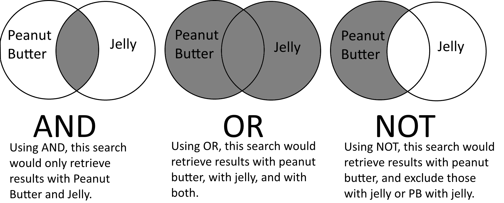
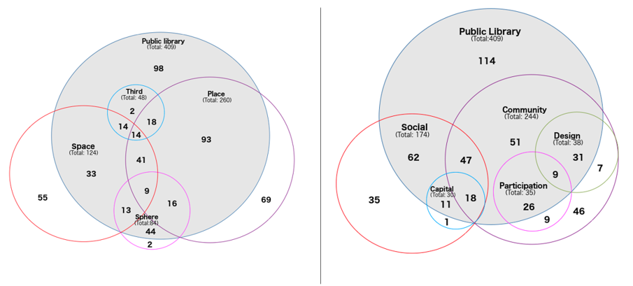
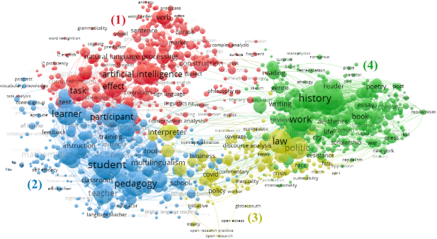
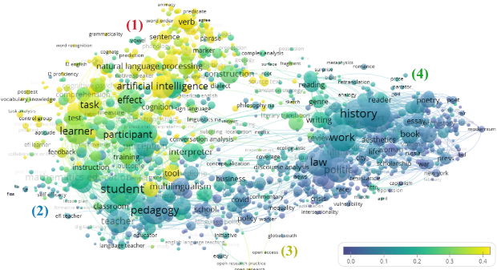

# Búsqueda, selección e integración del corpus bibliográfico

## Visión general del flujo de trabajo

Antes de ponernos a buscar, conviene tener claro el objetivo: no se trata de recopilar todo lo que existe sobre un tema, sino de construir un **corpus representativo, manejable y bien documentado** que permita responder a la pregunta de investigación.

También considera **qué tipo de revisión** vas a emplear, ya que la estrategia de búsqueda variará según el caso.

-   **Revisiones sistemáticas:** Protocolo de trabajo claro y reproducible donde la clave está en la ecuación de búsqueda empleada.

-   **Revisiones narrativas:** Protocolo más flexible, aunque no por ello significa que no se permita la introducción de fórmulas innovadoras y transparentes.
    Si somos rigurosos desde el principio, dejaremos en cada paso rastro documental, *lo que permitirá justificar más adelante si fuera necesario*.

Debido a la proliferación de revisiones sistemáticas, en ocasiones algún revisor insiste en indicar la metodología y estrategia de búsqueda.
Si no hemos llevado cuenta de ese registro documental, alguna alternativa que he empleado es esta que aquí indico:

[](https://doi.org/10.1002/asi.25012)

## Fuentes de información: ¿Qué bases de datos emplear?

**No existe una base de datos perfecta.** La elección depende del campo, del tipo de literatura que interesa y de los recursos disponibles.
Para ciencias sociales, las tres fuentes principales son:

### Web of Science (WoS)

| Ventajas | Limitaciones |
|------------------------------------|------------------------------------|
| Alta calidad y selectividad en la indexación. | Cobertura limitada de literatura en español y de revistas latinoamericanas o temáticas de carácter local |
| Excelente cobertura de revistas de alto impacto en ciencias sociales a nivel internacional | No cubre literatura gris ni tesis doctorales |
| Permite búsquedas muy precisas con operadores booleanos avanzados | Acceso restringido (requiere suscripción institucional) |
| Exportación limpia y estructurada (compatible con Zotero y VOSviewer directamente) | Sesgo hacia ciencias naturales y biomedicina en detrimento de humanidades |
| Datos de citación fiables y completos |  |

### Scopus

| Ventajas | Limitaciones |
|------------------------------------|------------------------------------|
| Mayor cobertura que WoS en número de revistas, especialmente en ciencias sociales y humanidades | Acceso restringido (requiere suscripción institucional) |
| Buena cobertura de literatura en español e iberoamericana | La mayor cobertura implica también mayor variabilidad en calidad |
| Interfaz de búsqueda potente y flexible | Datos de citación algo menos fiables que WoS para análisis bibliométricos precisos |
| Exportación estructurada compatible con Zotero y VOSviewer |  |

### Google Scholar

| Ventajas | Limitaciones |
|------------------------------------|------------------------------------|
| Acceso gratuito y universal | No permite exportación masiva directa (límite de \~1000 resultados con Publish or Perish) |
| Cobertura amplísima: incluye preprints, tesis, literatura gris, libros y capítulos | Calidad de metadatos muy variable: errores frecuentes en autores, años y títulos |
| Muy útil para campos emergentes o con literatura dispersa | No ofrece operadores booleanos avanzados comparables a WoS/Scopus |
| Imprescindible para detectar literatura en español no indexada en WoS/Scopus | Los resultados no son reproducibles: varían según el usuario, la sesión y el momento |

::: nota
👣 **Recomendación:** Para una revisión en ciencias sociales, combinar WoS + Scopus como fuentes principales y Google Scholar como fuente complementaria para detectar literatura no indexada.
Documentar siempre la fecha de búsqueda y la cadena de búsqueda exacta utilizada en cada base de datos.
:::

## Estrategias de búsqueda

### La clásica para revisiones sistemáticas

Una buena estrategia de búsqueda equilibra **sensibilidad** (no perderse nada relevante) y **especificidad** (no obtener miles de resultados irrelevantes).
El flujo clásico PRISMA es el siguiente:

1.  Identifico los términos de búsqueda esenciales, considerando: sinónimos, variantes ortográficas y términos en inglés y español.

2.  Combino los términos seleccionados empleando **operadores booleanos** y **operadores de truncamiento**, y diseño mi ecuación de búsqueda.

    {width="561"}

3.  **Evalúo y analizo los resultados** para valorar la pertinencia de los términos, eliminar y sustituir términos ambiguos, añadir otros términos relacionados, etc. Repito pasos 2 y 3 hasta estar satisfecho con la ecuación de búsqueda y los resultados obtenidos.

::: {#aviso}
**Truncamiento:** el asterisco `*` permite recuperar variantes de una raíz.
Por ejemplo, `academ*` recupera *academic*, *academics*, *academically*, etc.
Si se quiere controlar que varíe una sóla letra, se emplea el `?`

**Campos de búsqueda:** Es importante delimitar también los campos sobre los que se lanza la ecuación de búsqueda.
Por ejemplo, `Title-Abstract-Keywords`.
Buscar solo en título es más preciso pero puede perder resultados relevantes; buscar en texto completo genera demasiado ruido.
:::

#### Variante A. El uso de ontologías

Una variante interesante, es la de organizar esos términos de búsqueda por niveles y crear nuestra ontología específica para poder *trocear* nuestro corpus bibliográfico por distintos aspectos o conceptos a analizar.

{width="614"}

Aunque supone hacer muchas búsquedas por separado, permite luego analizar relaciones entre términos y conceptos de manera muy visual.

#### Variante B. Mapeo y zoom

Otra opción, es la de trabajar sobre un corpus bibliográfico más amplio que nuestro objeto de estudio.
En el ejemplo que os pongo a continuación, lo que hacemos es trabajar con documentos de un listado de revista del área de Traducción y después identificar en qué áreas se hablar sobre IA Generativa, con el objetivo de revisar después, cómo se está abordando el uso de la IAG en esta disciplina.



Este mapa está hecho con **Vosviewer**, luego lo veremos.
Con esta herramienta podemos *superponer* mapas, lo que se conoce como mapas *overlay* para cruzar la información que ofrece la red de términos con otras variables.
En este caso, la relación de los términos que se emplean con términos relacionados a la IAG.



### Revisiones narrativas

En estos casos, la rigurosidad y necesidad de protocolo preestablecido no es tan necesaria, por lo que se combinan de manera muy informal diferentes estrategias de búsqueda.
Aquí os enumero algunas:

-   **Clásica búsqueda en bases de datos**, siguiendo una aproximación similar a la estrategia anterior.

-   **Serendipia**, algo esencial en la ciencia, aunque muchas veces se nos olvide.
    Y si no, [mírate este paper](https://doi.org/10.1016/j.respol.2017.10.007) 😉.

-   **Búsqueda por autores/escuelas.** En muchos casos, identificar a las referencias del área es vital para poder identificar su trabajo y analizar su evolución más allá de los términos que hayan empleado para describir estos trabajos.

-   **Navegación a través de citas y referencias.** Muy útil a la hora de expandir nuestro corpus.
    También puede emplearse (aunque con algunas precauciones) esta estrategia en las revisiones sistemáticas.

## Zotero: instalación y configuración básica

Zotero es un gestor de referencias gratuito y de código abierto que permite importar, organizar y exportar referencias bibliográficas.
Es la herramienta central de este flujo de trabajo.

### Instalación

1.  Descargar Zotero desde [zotero.org](https://www.zotero.org/download/)
2.  Instalar el conector para el navegador (disponible para Chrome y Firefox) — permite guardar referencias directamente desde la web
3.  Crear una cuenta gratuita en zotero.org (permite sincronización y hasta 300 MB de almacenamiento gratuito)

### Configuración recomendada para revisiones sistemáticas

Antes de importar, crear una **biblioteca de grupo separada** para cada revisión.
Esto facilita el conteo de registros por base de datos y mantiene la biblioteca personal limpia.

Dentro de la biblioteca, crear una colección por base de datos:

```         
📁 [TEMA A ANALIZAR]
   📂 WoS
   📂 Scopus
   📂 Google Scholar
```

## Deduplicación en Zotero

Al importar desde varias bases de datos, es inevitable que algunas referencias aparezcan en más de una.
La deduplicación elimina estas repeticiones.

### Deduplicación automática en Zotero

Zotero identifica duplicados comparando título, DOI y año de publicación.
Para acceder a la vista de duplicados:

1.  En el panel izquierdo, hacer clic en *Elementos duplicados*
2.  Aparecerán agrupados los registros que Zotero considera duplicados
3.  Para cada grupo: seleccionar el registro *maestro* (el que tiene metadatos más completos) y hacer clic en *Combinar elementos*

**Limitación importante:** Zotero no permite combinar todos los duplicados de una vez — hay que hacerlo grupo a grupo.
Para bibliotecas grandes, el plugin **Zoplicate** acelera este proceso.

::: aviso
**Precaución:** No todos los elementos que Zotero identifica como duplicados lo son realmente.
Un artículo de conferencia y su versión publicada en revista pueden tener títulos similares sin ser el mismo trabajo.
Revisar siempre antes de combinar.
:::

### Limpieza asistida por LLM

La deduplicación automática de Zotero no detecta todos los casos problemáticos.
Algunos ejemplos habituales:

-   Mismo artículo con ligeras variaciones en el título (preprint vs. versión publicada)
-   Mismo autor con variantes ortográficas del nombre
-   Metadatos incompletos o erróneos que impiden la detección automática

Para estos casos, se puede exportar la biblioteca a bibtex (`Archivo → Exportar biblioteca → bib`) y usar un LLM para identificar duplicados no obvios.

**Ejemplo de prompt para Claude:**

```         
Tengo una lista de referencias bibliográficas exportadas de Zotero en bibtex. 
Necesito identificar posibles duplicados que no fueron detectados 
automáticamente. Pueden ser duplicados por:
- Mismo artículo con título ligeramente diferente (preprint vs publicado)
- Mismo trabajo con metadatos incompletos en una de las versiones
- Variantes en el nombre del autor

Por favor, analiza las siguientes referencias y señala los pares o grupos 
que podrían ser el mismo trabajo, indicando por qué lo sospechas:

[PEGAR REFERENCIAS EN CSV]
```

El LLM no toma decisiones por el investigador — sugiere candidatos a revisar.
La decisión final es siempre humana.

::: nota
**También existen plugins de IA para Zotero**.
Son opciones a explorar para flujos de trabajo más avanzados, aunque requieren clave de API propia o suscripción.
No he llegado a probarlos
:::

##  El corpus limpio: qué tenemos al final de este bloque

Al terminar el proceso de búsqueda, importación y deduplicación, debemos tener:

-   Un **recuento documentado** de registros por base de datos (imprescindible para PRISMA)
-   Un corpus de referencias sin duplicados, organizado en Zotero
-   Los metadatos básicos completos: título, autores, año, revista, DOI, abstract

Este corpus es el punto de partida para los dos bloques siguientes: NotebookLM (análisis cualitativo del contenido) y VOSviewer (análisis visual de la estructura del campo).
