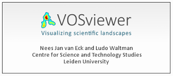
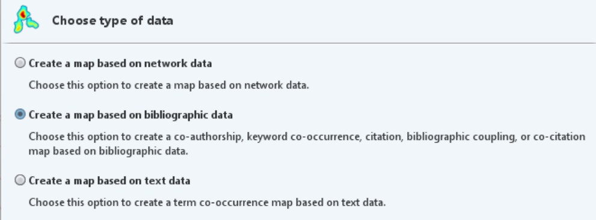
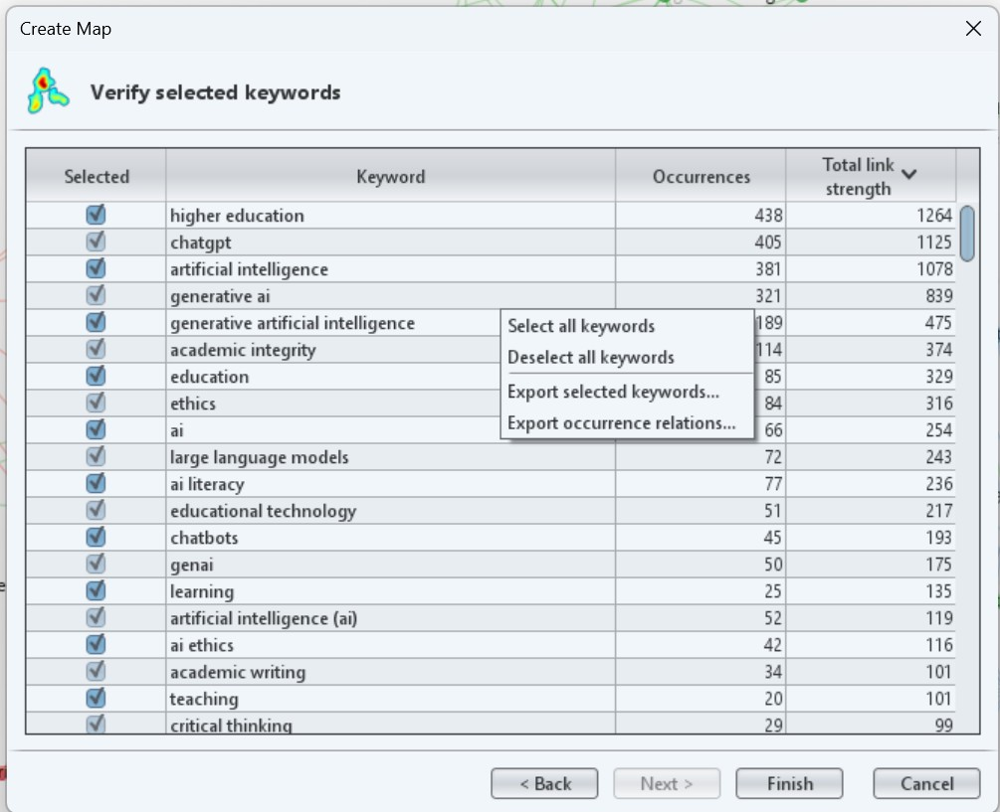
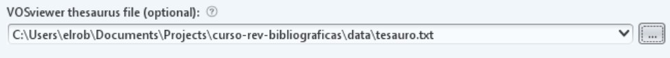

# Análisis visual con VOSviewer

## Qué es VOSviewer



VOSviewer es una herramienta gratuita desarrollada por el Centre for
Science and Technology Studies (CWTS) de la Universidad de Leiden para
la **construcción y visualización de redes bibliométricas**. Permite
representar visualmente la estructura intelectual de un campo de
investigación a partir de los metadatos de un corpus bibliográfico.

A diferencia de NotebookLM, que analiza el *contenido* de los textos,
VOSviewer analiza las *relaciones entre elementos bibliométricos*:
términos, autores, revistas, referencias. Es una herramienta
complementaria, no alternativa.

Descarga gratuita: [vosviewer.com](https://www.vosviewer.com)

VOSviewer puede construir varios tipos de redes. Para este curso nos
centraremos en la más útil para revisiones en ciencias sociales:

-   **Co-ocurrencia de términos.** Establece relaciones entre términos
    en base a las veces que aparecen de manera conjunta en distintos
    documentos.

-   **Co-autoría.** Permite analizar redes de colaboración entre autores
    en base a su co-ocurrencia en distintos documentos.

-   **Co-citación.** Dos artículos estarán relacionados entre sí si son
    citados con frecuencia de manera conjunta en otros trabajos.

-   **Acoplamiento bibliográfico:** Dos artículos estarán relacionados
    entre sí, si tienden a citar en su listado de referencias los mismos
    trabajos.

## Importación de datos

VOSviewer trabaja con datos bibliográficos y texto en distintos
formatos. Puede trabajar con tres tipos de ficheros esencialmente:

1.  **Ficheros extraídos desde una base de datos bibliográfica.**
    Soporta bases de datos tipo Web of Science, Scopus, OpenAlex o
    Dimensions entre otras. En algunos casos incluso permite trabajar
    directamente desde la API de la base de datos.
2.  **Ficheros exportados de un gestor bibliográfico.** También permite
    trabajar con ficheros en formato .ris o .bib extraídos por ejemplo,
    de Zotero.
3.  **Texto plano.** Para mapas de co-palabras se puede trabajar
    directamente con ficheros de texto donde cada línea representa un
    documento.

### Nuestro set de datos

Para esta pequeña práctica he preparado un set de datos de 1360
documentos extraídos de la Web of Science y relacionados con el uso
responsable de la IA en el entorno universitario. Esta es la estrategia
de búsqueda que he empleado:

```         
(generative AI OR ChatGPT OR LLM) AND ("higher education" OR universit*) AND (ethic* OR “pedagogy”)
```

[📂Descarga del primer fichero](data/savedrecs.txt) - [📂Descarga del
segundo fichero](data/savedrecs%20(1).txt)

Una vez descargados, toca cargarlos en VOSviewer:

1.  Abre el programa y dale a la opción `Create`, en el menú de la
    izquierda.

2.  En el menú que aparece, selecciona la opción
    `Create a map based on bibliographic data` y luego
    `Read data from bibliographic database files`.

    

3.  Finalmente, carga los dos ficheros de manera conjunta utilizando el
    atajo `Ctrl` del teclado.

### Creación de un mapa de co-ocurrencia de términos

Analiza con qué frecuencia dos términos aparecen juntos en los títulos
y/o abstracts del corpus. Los términos que co-ocurren frecuentemente
aparecen próximos en el mapa y forman **clusters temáticos** —
agrupaciones de conceptos que tienden a aparecer juntos en la
literatura.

**Para qué sirve:** identificar los grandes temas del campo, detectar
subtemas emergentes y visualizar la estructura conceptual de la
literatura sobre

1.  Selecciona tipo de análisis: *Co-occurrence* → *All keywords* (o
    *Title and abstract words*)
2.  Establece un umbral mínimo de ocurrencias (nosotros trabajaremos con
    la opción por defecto)
3.  VOSviewer mostrará cuántos términos cumplen el umbral → Una vez
    confirmemos, creará el mapa

::: {#aviso}
**Muy importante:** Como habrás observado, los términos que más veces
aparecen y controlan la red son los que empleé en la estrategia de
búsqueda. Esto puede ser problemático, al distorsionar la red. Para
evitar esto, podemos deseleccionar estos términos antes de crear el
mapa.
:::

## Creación de un tesauro y limpieza de datos

Este paso es **imprescindible** y frecuentemente omitido. VOSviewer
extrae todos los términos que superan el umbral, pero muchos de ellos
son irrelevantes: artículos, preposiciones, términos genéricos (*study*,
*analysis*, *results*, *paper*) o variantes del mismo concepto
(*student* / *students*).

### Limpieza manual

VOSviewer genera un listado de todos los términos seleccionados. Antes
de visualizar, se puede desactivar los términos irrelevantes desmarcando
la casilla correspondiente.

Términos que habitualmente conviene desactivar: - Términos muy
genéricos: *study*, *research*, *analysis*, *result*, *paper*,
*approach* - Variantes de términos ya incluidos: si está *student*,
desactivar *students* - Términos que corresponden al propio tema de
búsqueda y aparecerán en todo el corpus

### Limpieza asistida por LLM

Para corpus grandes con centenares de términos, exportar la lista de
términos como CSV y usar un LLM para sugerir cuáles eliminar o unificar:

```         
Tengo una lista de términos extraídos automáticamente de los títulos 
y abstracts de un corpus bibliográfico sobre [TEMA A ANALIZAR]. 
Necesito limpiarla antes de visualizar la red de co-ocurrencias.

Por favor, identifica:
1. Términos genéricos que no aportan información temática
2. Variantes del mismo concepto que deberían unificarse
3. Términos que parecen errores de extracción

Lista de términos:
[PEGAR LISTA]
```

El LLM sugiere; el investigador decide. Algunos términos que el modelo
propone eliminar pueden ser relevantes en el contexto específico del
campo.

### Creación de un tesauro

Antes de crear el mapa, es posible añadir un tesauro elaborado por
nosotros. Este tesauro sirve realmente para unificar términos sin
*tocar* los datos brutos de nuestro fichero. El tesauro debe ser un
fichero txt con dos columnas separadas por tabulador:

-   **label**.Incluye el término original de nuestro set de datos

-   **replace by.** Incluye el término normalizado

Para crear una tesauro, hay que extraer primero todos los términos que
ha generado VOSviewer. Para ello, cuando te muestra VOSviewer el listado
de términos, pincha con el botón derecho y en la opción
`Export selected keywords` y guardalo en un txt.

{width="419"}

Después, puedes adjuntar este fichero a un chatbot tipo ChatGPT, Gemini
o Claude y lanzar el siguiente prompt:

```         
Actúa como un experto en bibliometría. Te voy a pasar una lista de palabras clave extraídas de VOSviewer. Tu tarea es crear un archivo de tesauro. Identifica términos que significan lo mismo (ej: 'artificial intelligence' y 'ai', o 'chatgpt' y 'chat-gpt') y variaciones de plural/singular.

Dame el resultado exclusivamente en una tabla con dos columnas:

label: el término original.

replace by: el término único por el que se debe sustituir.

Mantén los términos técnicos académicos más precisos.
```

Guarda los resultados en un txt y vuelve a crear el mapa. En el momento
de elegir el tipo de mapa, añade tu nuevo tesauro en el apartado
correspondiente:



## Interpretación de clusters

Una vez limpio el mapa, VOSviewer muestra los términos agrupados en
clusters codificados por color. Cada cluster representa una
**constelación temática** — un conjunto de conceptos que tienden a
aparecer juntos en la literatura.

### Cómo leer el mapa

-   **Proximidad:** cuanto más cercanos dos términos, más frecuentemente
    co-ocurren.
-   **Tamaño del nodo:** cuanto más grande, más frecuente es ese término
    en el corpus.
-   **Color:** indica el cluster al que pertenece el término (asignado
    automáticamente por el algoritmo).
-   **Distancia entre clusters:** clusters alejados entre sí representan
    subtemas relativamente independientes.

### Nombrar los clusters

VOSviewer no nombra los clusters — esa es tarea del investigador. Para
nombrar cada cluster:

1.  Identificar los 3-5 términos con nodos más grandes dentro del
    cluster
2.  Leer algunos de los artículos más representativos de ese cluster
3.  Proponer un nombre que capture la orientación temática del conjunto

### Fortalezas del análisis de co-ocurrencia

-   Permite visualizar la estructura temática de un campo de forma
    rápida
-   Identifica subtemas que podrían no ser evidentes en una lectura
    lineal
-   Útil para detectar términos puente entre clusters (posibles áreas
    interdisciplinares)
-   Reproducible: dado el mismo corpus y los mismos parámetros, el mapa
    es el mismo

### Limitaciones del análisis de co-ocurrencia

-   **Depende de la calidad de los abstracts y palabras clave:** si los
    datos son pobres o inconsistentes, el mapa lo reflejará.
-   **No captura el significado:** dos términos pueden co-ocurrir porque
    se contrastan, no porque estén relacionados positivamente.
-   **Sensible al corpus:** pequeños cambios en el corpus (añadir o
    quitar 50 referencias) pueden cambiar significativamente la
    estructura de los clusters.
-   **El algoritmo de clustering es automático:** los clusters son una
    aproximación estadística, no categorías conceptuales establecidas.
-   **Sesgo hacia términos en inglés:** si el corpus mezcla idiomas, los
    términos en español o en otros idiomas quedarán subrepresentados.

## Otras herramientas similares: Bibliometrix y análisis avanzados

**Bibliometrix** es un paquete de R para análisis bibliométrico que
ofrece funcionalidades más avanzadas que VOSviewer, incluyendo análisis
de factor, evolución temporal de clusters, análisis de redes de
co-autoría e instituciones, y mayor control sobre los parámetros del
análisis.

Su interfaz web **Biblioshiny** permite acceder a las principales
funcionalidades sin necesidad de programar en R, aunque el paquete
completo requiere conocimientos básicos de R.

También en VOSviewer existen análisis más avanzados que quedan fuera del
alcance de este curso:

-   **Overlay maps:** mapas que añaden una variable temporal (año de
    publicación) o de impacto (número de citas) al mapa de
    co-ocurrencias, permitiendo visualizar la evolución del campo.
-   **Edición manual de clusters:** reagrupación manual de nodos para
    ajustar la clasificación automática.
-   **Análisis de co-citación y acoplamiento bibliográfico:** para
    identificar la estructura intelectual del campo con mayor precisión.

Estos análisis se desarrollarán en sesiones posteriores para quienes
quieran profundizar en el análisis bibliométrico.
