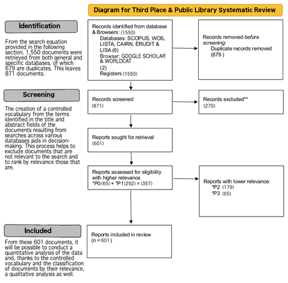

# Síntesis, organización y escritura

> **Nota:** Este bloque forma parte del material completo del curso pero
> no se imparte en todas las ediciones. Está diseñado para ser trabajado
> de forma autónoma o en sesiones específicas sobre metodología de
> revisiones bibliográficas.

## El modelo PRISMA

PRISMA (Preferred Reporting Items for Systematic Reviews and
Meta-Analyses) es el estándar más extendido para reportar revisiones
sistemáticas. No es un protocolo de investigación en sí mismo, sino una
**guía de reporte**: establece qué información debe incluirse en el
manuscrito para que la revisión sea transparente y reproducible.

La versión vigente es **PRISMA 2020**, que actualizó la versión de 2009
para incorporar los cambios en las prácticas de revisión sistemática,
incluyendo la búsqueda en registros de preprints y el uso de
herramientas automatizadas.

### El diagrama de flujo PRISMA

El elemento más reconocible de PRISMA es su [diagrama de
flujo](https://www.prisma-statement.org/prisma-2020-flow-diagram), que
documenta el proceso de identificación, cribado y selección de estudios:

Los recuentos para completar este diagrama se obtienen directamente del
proceso documentado en Zotero.

### Protocolo de trabajo previo

Para una revisión sistemática rigurosa, el protocolo debe definirse
**antes** de realizar la búsqueda, no después. Esto incluye:

-   Pregunta de investigación (en formato PICo u otro marco
    estructurado)
-   Criterios de elegibilidad (inclusión y exclusión)
-   Fuentes de información y estrategia de búsqueda
-   Proceso de selección de estudios (número de revisores, manejo de
    discrepancias)
-   Proceso de extracción de datos
-   Evaluación del riesgo de sesgo

### PRISMA en ciencias sociales

El uso de PRISMA en ciencias sociales requiere algunas adaptaciones. La
heterogeneidad metodológica de los estudios en ciencias sociales hace
que los criterios de inclusión/exclusión sean más complejos y que la
síntesis cuantitativa (meta-análisis) sea menos frecuente.

En ciencias sociales es habitual usar **síntesis narrativa
estructurada** en lugar de meta-análisis, con tablas de extracción de
datos que permiten comparar estudios de forma sistemática aunque no
cuantitativa.

## Proceso de lectura

### Lectura en dos velocidades

No todos los artículos de un corpus merecen el mismo nivel de atención.
Una gestión eficiente del tiempo de lectura implica distinguir:

| Lectura de cribado | Lectura profunda |
|------------------------------------|------------------------------------|
| Título, abstract y conclusiones | Texto completo, incluyendo metodología, resultados y discusión |
| **Objetivo:** decidir si el artículo es relevante para la pregunta de investigación | **Objetivo:** extraer datos, evaluar calidad metodológica, comprender argumentos - Reservada para los artículos que superan el cribado |
| **Tiempo estimado:** 2-5 minutos por artículo | **Tiempo estimado:** 30-90 minutos por artículo |

El análisis con NotebookLM y VOSviewer (Bloques 3 y 4) ayuda a priorizar
qué artículos merecen lectura profunda y cuáles pueden quedar en lectura
de cribado.

### Toma de notas

Una buena toma de notas durante la lectura profunda es la base de una
síntesis de calidad. Algunos principios:

-   Tomar notas en tus propias palabras, no copiando frases del artículo
-   Registrar siempre la referencia completa junto a cada nota
-   Distinguir entre lo que dice el autor y tu propia interpretación
-   Anotar preguntas y dudas que surjan durante la lectura
-   Registrar las limitaciones que el propio autor reconoce

**Herramientas útiles:**

-   Zotero permite añadir notas a cada referencia, lo que mantiene todo
    centralizado

-   NotebookLM permite construir notas acumulativas vinculadas al corpus
    (véase Bloque 3)

-   Una hoja de extracción de datos (en Excel o Google Sheets) para
    sistematizar la información entre artículos

## Estructuras posibles para la revisión

No existe una única estructura correcta para una revisión bibliográfica.
La estructura debe estar al servicio de la pregunta y del tipo de
revisión. Algunas opciones habituales:

### Estructura temática

Organiza la revisión en secciones correspondientes a los grandes temas o
subtemas identificados en el corpus. Es la más habitual en revisiones
narrativas y en revisiones sistemáticas con síntesis narrativa.

**Cuándo usarla:** cuando el objetivo es mapear la diversidad temática
del campo. Los clusters de VOSviewer y las agrupaciones de NotebookLM
pueden ser un buen punto de partida para definir las secciones.

### Estructura cronológica

Organiza la revisión siguiendo la evolución histórica del campo. Útil
para mostrar cómo ha cambiado la comprensión de un fenómeno o cómo han
evolucionado los debates.

**Cuándo usarla:** cuando el objetivo es mostrar el desarrollo histórico
de un campo o cuando hay un punto de inflexión claro (un evento, una
publicación seminal, un cambio de paradigma) que estructura la
narrativa.

### Estructura metodológica

Organiza la revisión según los enfoques metodológicos de los estudios
incluidos (cuantitativos, cualitativos, mixtos; experimentales,
observacionales, etc.).

**Cuándo usarla:** cuando el objetivo es evaluar críticamente cómo se ha
estudiado un fenómeno, no solo qué se ha encontrado.

### Estructura por pregunta o hipótesis

Organiza la revisión en torno a las subpreguntas que componen la
pregunta de investigación principal, respondiendo cada una en una
sección.

**Cuándo usarla:** en revisiones sistemáticas con preguntas bien
delimitadas.

### Un ejemplo de revisión asistida por IA

> Robinson-Garcia, N., van Schalkwyk, F., Tirado, M. M., Pham, V., &
> Melkers, J. (2024). What's in a team? Variability and discrepancies in
> the conceptualization and operationalization of scientific teams
> (Versión 1). 28th International Conference on Science, Technology and
> Innovation Indicators (STI 2024), Berlin. Zenodo.
> <https://doi.org/10.5281/zenodo.12726921>

En este trabajo de congreso, queríamos analizar qué se entiende por
**equipo científico** en la literatura de evaluación de la ciencia y
cienciometría. Para ello, seguimos la siguiente estrategia

**Selección del corpus.** Hicimos dos búsquedas en WoS:

1.  En la primera buscábamos sólo revisiones sobre equipos científicos
2.  En la segunda buscábamos artículos pero sólo publicados en la
    revista *Research Evaluation*. A partir de los resultados,
    identificamos los estudios más co-citados (al menos 3 co-citas), lo
    que nos redujo el set de datos a 46 publicaciones.

Tres investigadores revisamos de forma independiente y manual buscando
definiciones explícitas de equipo científico, reduciendo el corpus final
a **26 publicaciones**.

**Codificación manual.** Antes de recurrir al LLM, codificamos
manualmente cada publicación en busca de definiciones y atributos de los
equipos científicos. Este proceso por múltiples codificadores permitió
contrastar después los resultados con los del modelo.

**Uso de GPT-4.** Sobre ese corpus de 26 estudios, utilizamos GPT-4 para
tres tareas acotadas por documento:

1.  Evaluar el nivel de acuerdo con la codificación manual.
2.  Extraer la definición explícita de equipo con indicación de página
3.  Inferir los atributos esenciales que debe tener un equipo
    científico.

Tras el análisis individual, lanzamos un análisis global para formular
una definición unificada e identificar atributos comunes y
discrepancias.

Tres aspectos de este uso merecen atención:

-   **Supervisión explícita.** El proceso fue supervisado en todo
    momento y las respuestas del modelo fueron corregidas cuando fue
    necesario.
-   **Transparencia total.** La conversación completa con ChatGPT fue
    publicada y está disponible públicamente, haciendo el proceso
    replicable.
-   **Uso acotado.** El LLM no redactó ni sintetizó de forma autónoma:
    se usó como herramienta de extracción y codificación asistida sobre
    un corpus previamente seleccionado y revisado.

::: nota
Este ejemplo ilustra la distinción entre usar un LLM como **asistente de
análisis** — con tareas definidas, supervisión constante y reporte
transparente — y usarlo como **sustituto del análisis**. El valor
añadido del investigador está en el diseño del proceso, la supervisión y
la interpretación final.
:::

## Errores típicos

### Errores de estructura y enfoque

-   **El "laundry list":** enumerar estudios uno tras otro sin síntesis
    ni argumento. La revisión no es un catálogo; es una argumentación.
-   **Ausencia de hilo conductor:** el lector no entiende qué pregunta
    responde la revisión ni cómo cada sección contribuye a responderla.
-   **Desequilibrio entre descripción y análisis:** dedicar demasiado
    espacio a describir qué dice cada estudio y poco a analizarlo
    críticamente.

### Errores de selección y cobertura

-   **Sesgo de confirmación:** seleccionar preferentemente estudios que
    apoyan la posición del autor.
-   **Descuidar literatura contradictoria:** omitir estudios que ofrecen
    resultados o interpretaciones contrarias a la conclusión principal.
-   **Cobertura temporal desactualizada:** no incluir literatura
    reciente relevante.
-   **Sesgo lingüístico:** incluir solo literatura en inglés cuando
    existe literatura relevante en otros idiomas.

### Errores de síntesis

-   **Generalizar en exceso:** extraer conclusiones más amplias de lo
    que la evidencia revisada permite.
-   **Ignorar el contexto:** presentar hallazgos de contextos muy
    específicos como si fueran universales.
-   **No evaluar la calidad metodológica:** tratar todos los estudios
    como equivalentes independientemente de su rigor.

### Errores formales

-   **Citar sin leer:** incluir referencias que no se han leído
    directamente (citas de segunda mano no identificadas como tales).
-   **Confundir citación y atribución:** atribuir a un autor una
    afirmación que en realidad está en otro artículo.

## El proceso de escritura

### Escribir antes de "tener todo"

Un error frecuente es esperar a haber leído todo el corpus para empezar
a escribir. La escritura es también un proceso de clarificación del
pensamiento. Algunas estrategias:

-   Escribir resúmenes de cada artículo inmediatamente después de
    leerlo, mientras está fresco
-   Escribir borradores de sección aunque estén incompletos — se pueden
    rellenar después
-   Usar las notas de NotebookLM como punto de partida para el borrador

### El papel de los LLMs en la escritura

Los LLMs pueden ser útiles en varias fases del proceso de escritura:

**Útil:** - Mejorar la redacción y claridad de párrafos ya escritos -
Sugerir alternativas de formulación para ideas propias - Detectar
inconsistencias o falta de claridad en la argumentación - Revisar la
coherencia lógica entre secciones

**No adecuado:** - Generar el texto de síntesis directamente (el
conocimiento sobre el corpus es del investigador, no del modelo) -
Sustituir el análisis crítico propio - Redactar la discusión o las
conclusiones sin control exhaustivo del investigador

### Revisión y cierre

Antes de considerar un borrador terminado, conviene revisar
explícitamente:

-   ¿Cada sección responde a la pregunta de investigación o se desvía?
-   ¿Las conclusiones están sustentadas por la evidencia presentada?
-   ¿Se han reconocido las limitaciones de la propia revisión?
-   ¿El diagrama PRISMA es coherente con el texto?
-   ¿Todas las referencias citadas en el texto están en la bibliografía
    y viceversa?

## Consejos finales

-   **Una revisión es un argumento, no un resumen.** El valor está en lo
    que tú aportas al interpretar y sintetizar la literatura, no en la
    cantidad de artículos citados.
-   **La transparencia metodológica es parte de la calidad.** Documentar
    el proceso (incluyendo las herramientas usadas y cómo se usaron) no
    es burocracia — es rigor.
-   **Las herramientas cambian, los principios no.** NotebookLM,
    VOSviewer y Zotero son herramientas del momento. Los principios de
    una buena pregunta de investigación, una búsqueda transparente y una
    síntesis crítica son más duraderos.
-   **Compartir el protocolo antes de empezar** — aunque sea en un
    documento de trabajo interno — obliga a pensar con claridad sobre
    qué se quiere hacer y protege frente a la deriva durante el proceso.
