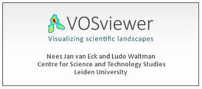
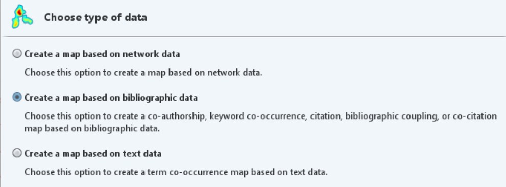
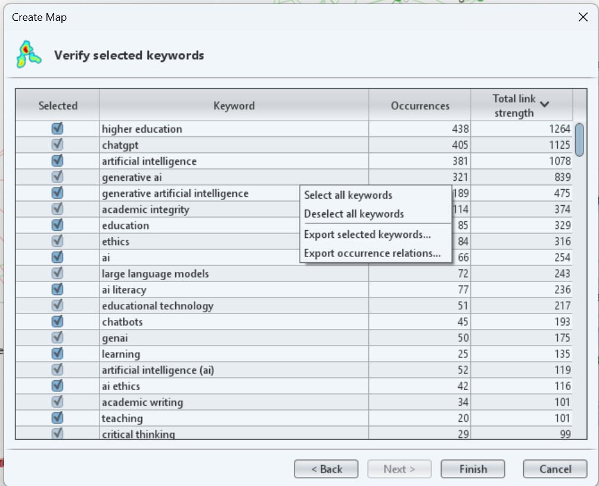
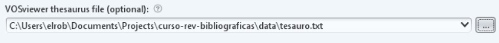
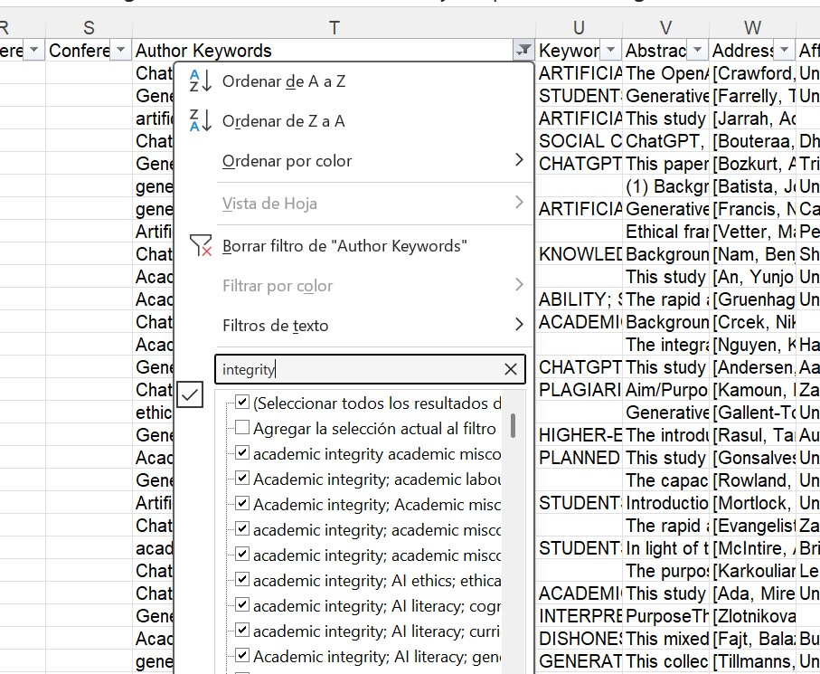

# (APPENDIX) Apéndices {-}

# Herramientas de apoyo: VOSviewer, NotebookLM y Zotero {-}

> **Nota:** Este apéndice recoge en detalle herramientas que pueden ser especialmente útiles en la elaboración y análisis de resultados de cara a una revisión bibliográfica.

| Apartado | Descripción |
|----------|-------------|
| A | Zotero: Gestión bibliográfica |
| B | VosViewer: Visualización temática |
| C | NotebookLM para cribado de lecturas |

# Zotero: Gestión bibliográfica {#zotero}

Zotero es un gestor de referencias gratuito y de código abierto que permite importar, organizar y exportar referencias bibliográficas. Es la herramienta central de este flujo de trabajo.

## Instalación

1.  Descargar Zotero desde [zotero.org](https://www.zotero.org/download/)
2.  Instalar el conector para el navegador (disponible para Chrome y Firefox) — permite guardar referencias directamente desde la web
3.  Crear una cuenta gratuita en zotero.org (permite sincronización y hasta 300 MB de almacenamiento gratuito)

## Configuración recomendada para revisiones sistemáticas

Antes de importar, crear una **biblioteca de grupo separada** para cada revisión. Esto facilita el conteo de registros por base de datos y mantiene la biblioteca personal limpia.

Dentro de la biblioteca, crear una colección por base de datos:

```
📁 [TEMA A ANALIZAR]
   📂 WoS
   📂 Scopus
   📂 Google Scholar
```

## Deduplicación de registros

Al importar desde varias bases de datos, es inevitable que algunas referencias aparezcan en más de una. La deduplicación elimina estas repeticiones.

### Deduplicación automática en Zotero

Zotero identifica duplicados comparando título, DOI y año de publicación. Para acceder a la vista de duplicados:

1.  En el panel izquierdo, hacer clic en *Elementos duplicados*
2.  Aparecerán agrupados los registros que Zotero considera duplicados
3.  Para cada grupo: seleccionar el registro *maestro* (el que tiene metadatos más completos) y hacer clic en *Combinar elementos*

**Limitación importante:** Zotero no permite combinar todos los duplicados de una vez — hay que hacerlo grupo a grupo. Para bibliotecas grandes, el plugin **Zoplicate** acelera este proceso.

::: aviso
**Precaución:** No todos los elementos que Zotero identifica como duplicados lo son realmente. Un artículo de conferencia y su versión publicada en revista pueden tener títulos similares sin ser el mismo trabajo. Revisar siempre antes de combinar.
:::

### Limpieza asistida por LLM

La deduplicación automática de Zotero no detecta todos los casos problemáticos. Algunos ejemplos habituales:

-   Mismo artículo con ligeras variaciones en el título (preprint vs. versión publicada)
-   Mismo autor con variantes ortográficas del nombre
-   Metadatos incompletos o erróneos que impiden la detección automática

Para estos casos, se puede exportar la biblioteca a bibtex (`Archivo → Exportar biblioteca → bib`) y usar un LLM para identificar duplicados no obvios.

**Ejemplo de prompt para Claude:**

```
Tengo una lista de referencias bibliográficas exportadas de Zotero en bibtex.
Necesito identificar posibles duplicados que no fueron detectados
automáticamente. Pueden ser duplicados por:
- Mismo artículo con título ligeramente diferente (preprint vs publicado)
- Mismo trabajo con metadatos incompletos en una de las versiones
- Variantes en el nombre del autor

Por favor, analiza las siguientes referencias y señala los pares o grupos
que podrían ser el mismo trabajo, indicando por qué lo sospechas:

[PEGAR REFERENCIAS EN CSV]
```

El LLM no toma decisiones por el investigador — sugiere candidatos a revisar. La decisión final es siempre humana.

::: nota
**También existen plugins de IA para Zotero**. Son opciones a explorar para flujos de trabajo más avanzados, aunque requieren clave de API propia o suscripción. No he llegado a probarlos
:::

# VOSviewer: Visualización temática {#vosviewer}



VOSviewer es una herramienta gratuita desarrollada por el Centre for Science and Technology Studies (CWTS) de la Universidad de Leiden para la **construcción y visualización de redes bibliométricas**. Permite representar visualmente la estructura intelectual de un campo de investigación a partir de los metadatos de un corpus bibliográfico.

A diferencia de NotebookLM, que analiza el *contenido* de los textos, VOSviewer analiza las *relaciones entre elementos bibliométricos*: términos, autores, revistas, referencias. Es una herramienta complementaria, no alternativa.

Descarga gratuita: [vosviewer.com](https://www.vosviewer.com)

VOSviewer puede construir varios tipos de redes. Para este curso nos centraremos en la más útil para revisiones en ciencias sociales:

-   **Co-ocurrencia de términos.** Establece relaciones entre términos en base a las veces que aparecen de manera conjunta en distintos documentos.

-   **Co-autoría.** Permite analizar redes de colaboración entre autores en base a su co-ocurrencia en distintos documentos.

-   **Co-citación.** Dos artículos estarán relacionados entre sí si son citados con frecuencia de manera conjunta en otros trabajos.

-   **Acoplamiento bibliográfico:** Dos artículos estarán relacionados entre sí, si tienden a citar en su listado de referencias los mismos trabajos.

## Importación de datos en VOSviewer

VOSviewer trabaja con datos bibliográficos y texto en distintos formatos. Puede trabajar con tres tipos de ficheros esencialmente:

1.  **Ficheros extraídos desde una base de datos bibliográfica.** Soporta bases de datos tipo Web of Science, Scopus, OpenAlex o Dimensions entre otras. En algunos casos incluso permite trabajar directamente desde la API de la base de datos.
2.  **Ficheros exportados de un gestor bibliográfico.** También permite trabajar con ficheros en formato .ris o .bib extraídos por ejemplo, de Zotero.
3.  **Texto plano.** Para mapas de co-palabras se puede trabajar directamente con ficheros de texto donde cada línea representa un documento.

### Nuestro set de datos

Para esta pequeña práctica he preparado un set de datos de 1360 documentos extraídos de la Web of Science y relacionados con el uso responsable de la IA en el entorno universitario. Esta es la estrategia de búsqueda que he empleado:

```
(generative AI OR ChatGPT OR LLM) AND ("higher education" OR universit*) AND (ethic* OR “pedagogy”)
```

[📂Descarga del primer fichero](data/savedrecs.txt) - [📂Descarga del segundo fichero](data/savedrecs%20(1).txt)

Una vez descargados, toca cargarlos en VOSviewer:

1.  Abre el programa y dale a la opción `Create`, en el menú de la izquierda.

2.  En el menú que aparece, selecciona la opción `Create a map based on bibliographic data` y luego `Read data from bibliographic database files`.

    

3.  Finalmente, carga los dos ficheros de manera conjunta utilizando el atajo `Ctrl` del teclado.

### Creación de un mapa de co-ocurrencia de términos

Analiza con qué frecuencia dos términos aparecen juntos en los títulos y/o abstracts del corpus. Los términos que co-ocurren frecuentemente aparecen próximos en el mapa y forman **clusters temáticos** — agrupaciones de conceptos que tienden a aparecer juntos en la literatura.

**Para qué sirve:** identificar los grandes temas del campo, detectar subtemas emergentes y visualizar la estructura conceptual de la literatura sobre

1.  Selecciona tipo de análisis: *Co-occurrence* → *All keywords* (o *Title and abstract words*)
2.  Establece un umbral mínimo de ocurrencias (nosotros trabajaremos con la opción por defecto)
3.  VOSviewer mostrará cuántos términos cumplen el umbral → Una vez confirmemos, creará el mapa

::: {#aviso-vosviewer}
**Muy importante:** Como habrás observado, los términos que más veces aparecen y controlan la red son los que empleé en la estrategia de búsqueda. Esto puede ser problemático, al distorsionar la red. Para evitar esto, podemos deseleccionar estos términos antes de crear el mapa.
:::

## Creación de un tesauro y limpieza de datos

Este paso es **imprescindible** y frecuentemente omitido. VOSviewer extrae todos los términos que superan el umbral, pero muchos de ellos son irrelevantes: artículos, preposiciones, términos genéricos (*study*, *analysis*, *results*, *paper*) o variantes del mismo concepto (*student* / *students*).

### Limpieza manual

VOSviewer genera un listado de todos los términos seleccionados. Antes de visualizar, se puede desactivar los términos irrelevantes desmarcando la casilla correspondiente.

Términos que habitualmente conviene desactivar: - Términos muy genéricos: *study*, *research*, *analysis*, *result*, *paper*, *approach* - Variantes de términos ya incluidos: si está *student*, desactivar *students* - Términos que corresponden al propio tema de búsqueda y aparecerán en todo el corpus

### Limpieza asistida por LLM (VOSviewer)

Para corpus grandes con centenares de términos, exportar la lista de términos como CSV y usar un LLM para sugerir cuáles eliminar o unificar:

```
Tengo una lista de términos extraídos automáticamente de los títulos
y abstracts de un corpus bibliográfico sobre [TEMA A ANALIZAR].
Necesito limpiarla antes de visualizar la red de co-ocurrencias.

Por favor, identifica:
1. Términos genéricos que no aportan información temática
2. Variantes del mismo concepto que deberían unificarse
3. Términos que parecen errores de extracción

Lista de términos:
[PEGAR LISTA]
```

El LLM sugiere; el investigador decide. Algunos términos que el modelo propone eliminar pueden ser relevantes en el contexto específico del campo.

### Creación de un tesauro

Antes de crear el mapa, es posible añadir un tesauro elaborado por nosotros. Este tesauro sirve realmente para unificar términos sin *tocar* los datos brutos de nuestro fichero. El tesauro debe ser un fichero txt con dos columnas separadas por tabulador:

-   **label**.Incluye el término original de nuestro set de datos

-   **replace by.** Incluye el término normalizado

Para crear una tesauro, hay que extraer primero todos los términos que ha generado VOSviewer. Para ello, cuando te muestra VOSviewer el listado de términos, pincha con el botón derecho y en la opción `Export selected keywords` y guardalo en un txt.

{width="419"}

Después, puedes adjuntar este fichero a un chatbot tipo ChatGPT, Gemini o Claude y lanzar el siguiente prompt:

```
Actúa como un experto en bibliometría. Te voy a pasar una lista de palabras clave extraídas de VOSviewer. Tu tarea es crear un archivo de tesauro. Identifica términos que significan lo mismo (ej: 'artificial intelligence' y 'ai', o 'chatgpt' y 'chat-gpt') y variaciones de plural/singular.

Dame el resultado exclusivamente en una tabla con dos columnas:

label: el término original.

replace by: el término único por el que se debe sustituir.

Mantén los términos técnicos académicos más precisos.
```

Guarda los resultados en un txt y vuelve a crear el mapa. En el momento de elegir el tipo de mapa, añade tu nuevo tesauro en el apartado correspondiente:



## Interpretación de clusters

Una vez limpio el mapa, VOSviewer muestra los términos agrupados en clusters codificados por color. Cada cluster representa una **constelación temática** — un conjunto de conceptos que tienden a aparecer juntos en la literatura.

### Cómo leer el mapa

-   **Proximidad:** cuanto más cercanos dos términos, más frecuentemente co-ocurren.
-   **Tamaño del nodo:** cuanto más grande, más frecuente es ese término en el corpus.
-   **Color:** indica el cluster al que pertenece el término (asignado automáticamente por el algoritmo).
-   **Distancia entre clusters:** clusters alejados entre sí representan subtemas relativamente independientes.

### Nombrar los clusters

VOSviewer no nombra los clusters — esa es tarea del investigador. Para nombrar cada cluster:

1.  Identificar los 3-5 términos con nodos más grandes dentro del cluster
2.  Leer algunos de los artículos más representativos de ese cluster
3.  Proponer un nombre que capture la orientación temática del conjunto

### Fortalezas del análisis de co-ocurrencia

-   Permite visualizar la estructura temática de un campo de forma rápida
-   Identifica subtemas que podrían no ser evidentes en una lectura lineal
-   Útil para detectar términos puente entre clusters (posibles áreas interdisciplinares)
-   Reproducible: dado el mismo corpus y los mismos parámetros, el mapa es el mismo

### Limitaciones del análisis de co-ocurrencia

-   **Depende de la calidad de los abstracts y palabras clave:** si los datos son pobres o inconsistentes, el mapa lo reflejará.
-   **No captura el significado:** dos términos pueden co-ocurrir porque se contrastan, no porque estén relacionados positivamente.
-   **Sensible al corpus:** pequeños cambios en el corpus (añadir o quitar 50 referencias) pueden cambiar significativamente la estructura de los clusters.
-   **El algoritmo de clustering es automático:** los clusters son una aproximación estadística, no categorías conceptuales establecidas.
-   **Sesgo hacia términos en inglés:** si el corpus mezcla idiomas, los términos en español o en otros idiomas quedarán subrepresentados.

## Otras herramientas similares: análisis avanzados

También en VOSviewer existen análisis más avanzados que quedan fuera del alcance de este curso:

-   **Overlay maps:** mapas que añaden una variable temporal (año de publicación) o de impacto (número de citas) al mapa de co-ocurrencias, permitiendo visualizar la evolución del campo.
-   **Edición manual de clusters:** reagrupación manual de nodos para ajustar la clasificación automática.
-   **Análisis de co-citación y acoplamiento bibliográfico:** para identificar la estructura intelectual del campo con mayor precisión.

Estos análisis se desarrollarán en sesiones posteriores para quienes quieran profundizar en el análisis bibliométrico. *(Bibliometrix se presenta en el Bloque 3; aquí puedes ampliar con el detalle práctico si lo necesitas.)*

# NotebookLM para cribado de lecturas {#notebooklm}

NotebookLM es una herramienta de Google basada en modelos de lenguaje (actualmente Gemini) diseñada para trabajar con documentos propios. A diferencia de un chatbot genérico, NotebookLM **solo responde basándose en las fuentes que tú le proporcionas** — no accede a internet ni a su base de conocimiento general para responder preguntas sobre el contenido de tus documentos.

Esto lo convierte en una herramienta especialmente útil para revisiones bibliográficas: permite interrogar un corpus de textos de forma sistemática sin el riesgo de que el modelo "rellene" con información externa no verificada.

## Acceso y licencia

NotebookLM es gratuito con una cuenta de Google. La Universidad de Granada ofrece acceso a **Google Workspace for Education** (Go UGR) con cuentas `@go.ugr.es`, lo que incluye acceso a NotebookLM con las garantías de privacidad del acuerdo institucional con Google. Se recomienda usar siempre la cuenta institucional para trabajar con documentos de investigación.

Acceso: [notebooklm.google.com](https://notebooklm.google.com)

::: nota
**Nota:** NotebookLM Plus (versión de pago) ofrece límites más altos de fuentes y consultas. Para los usos habituales de una revisión bibliográfica, la versión gratuita es suficiente.
:::

## Paso a paso: crear un notebook y cargar fuentes

### 1. Crear un nuevo notebook

1.  Acceder a [notebooklm.google.com](https://notebooklm.google.com) con la cuenta `@go.ugr.es`
2.  Hacer clic en *Nuevo notebook*

### 2. Cargar fuentes

NotebookLM acepta varios tipos de fuentes:

-   **PDFs** — la opción más habitual para artículos científicos
-   **Google Docs y Google Drive** — útil para notas propias o documentos de trabajo
-   **URLs** — páginas web y artículos online
-   **Texto pegado directamente**
-   **Vídeos de YouTube** (transcribe automáticamente)

En nuestro caso, podemos lanzar una búsqueda por términos de un cluster específico de nuestro mapa en el campo de palabras clave de nuestro fichero Excel y hacer un barrido manual sobre pertinencia y relevancia de los mismos.

{width="438"}

Una vez identificados los textos, podemos localizar los PDFs correspondientes y cargarlos en NotebookLM agrupados por temática si el corpus es grande.

**Límites actuales:** hasta 50 fuentes por notebook y 500.000 palabras por fuente.

::: aviso
**Importante:** NotebookLM no es un repositorio de PDFs — trabaja sobre los documentos que tú le proporcionas. No tiene acceso a bases de datos bibliográficas ni puede buscar artículos por ti.
:::

## Prompts efectivos: cómo interrogar el corpus

La calidad de las respuestas de NotebookLM depende en gran medida de cómo se formulan las preguntas. Algunos principios básicos:

### Prompts generales (sobre todo el corpus)

Útiles para obtener una primera visión de conjunto:

```
Resume los principales temas o líneas de investigación que aparecen
en las fuentes cargadas. Incluye los trabajos que abordan cada una de estas líneas y desde qué perspectiva lo hace cada uno
```

```
Crea una tabla con las principales metodologías más frecuentes empleadas en estos estudios. Quiero que la tabla tenga tres columnas: Metodología, breve descripción, referencia de trabajos que la emplean
```

```
Hazme un breve resumen por cada una de las fuentes que tienes. Quiero que en ese resumen destaques no sólo el objetivo del estudio y cómo se abordó, sino que te centres en aspectos relacionados con X.
```

### Prompts dirigidos a documentos específicos

NotebookLM permite seleccionar fuentes concretas antes de hacer una pregunta. Esto es especialmente útil para comparar posiciones o profundizar en un artículo:

1.  En el panel de fuentes, seleccionar uno o varios documentos específicos
2.  Formular la pregunta — NotebookLM responderá solo con base en esas fuentes

Ejemplos:

```
[Seleccionando 2-3 artículos teóricos]
¿Cómo definen estos autores el concepto Y?
¿Hay diferencias entre sus definiciones?
```

```
[Seleccionando un artículo metodológico]
¿Qué limitaciones reconocen los autores en su propio estudio?
```

## Outputs: informes, infografías y presentaciones

NotebookLM puede generar varios tipos de outputs a partir del corpus:

### Notas generadas por IA

Desde el panel de notas, se pueden generar automáticamente: - **Resumen del notebook** — síntesis general de todas las fuentes - **Guía de estudio** — estructura jerarquizada de conceptos clave - **Índice de contenidos** — organización temática de las fuentes - **Línea temporal** — si las fuentes contienen referencias cronológicas

### Audio overview

NotebookLM puede generar un **podcast sintético** (en inglés) con dos voces que dialogan sobre el contenido del corpus. Es una forma rápida de obtener una primera orientación sobre los temas principales, aunque debe tomarse como punto de partida, no como síntesis definitiva.

### Exportar y compartir

Las notas generadas pueden exportarse como texto o Google Doc, y el notebook puede compartirse con colaboradores (útil para revisiones en equipo).

## Generar notas y añadirlas como fuentes

Una de las funcionalidades más potentes de NotebookLM es el **ciclo nota-fuente**: las notas que generas (o que genera la IA) pueden añadirse como fuentes adicionales, lo que permite construir una síntesis progresiva.

Flujo de trabajo recomendado:

1.  Cargar el corpus inicial de PDFs
2.  Generar notas temáticas con prompts dirigidos
3.  Revisar y editar las notas (esto es fundamental — ver sección de limitaciones)
4.  Añadir las notas revisadas como fuentes adicionales
5.  Formular preguntas de síntesis que integren tanto los artículos originales como tus propias notas

Este proceso convierte NotebookLM en un **cuaderno de trabajo acumulativo** que va incorporando tu propia interpretación del corpus.

## Limitaciones y buenas prácticas de NotebookLM

### Lo que NotebookLM hace bien

-   Identificar rápidamente temas recurrentes en un corpus amplio
-   Localizar pasajes relevantes dentro de documentos largos
-   Generar primeras síntesis que sirven como punto de partida
-   Ayudar a priorizar qué documentos merecen lectura profunda

### Lo que NotebookLM no hace bien

-   **No razona sobre lo que no está en el corpus.** Si un artículo relevante no está cargado, NotebookLM no lo "sabe" — y no te avisará de su ausencia.
-   **Puede generar síntesis plausibles pero incorrectas.** El modelo puede confundir autores, atribuir argumentos incorrectamente o simplificar matices importantes. *Siempre verificar en el documento original.*
-   **No sustituye la lectura profunda.** NotebookLM puede decirte *que* un artículo habla de X, pero no puede reemplazar la comprensión crítica que se obtiene leyendo el artículo.
-   **Tiende a nivelas diferencias.** En su síntesis, el modelo puede suavizar contradicciones o tensiones entre autores que son precisamente lo más interesante del corpus.

### Verificación de la información

NotebookLM incluye **citas con número de fuente** en sus respuestas, lo que permite localizar el pasaje original. Ante cualquier afirmación que vaya a usarse en el texto de la revisión:

1.  Localizar la cita en el documento original
2.  Leer el contexto completo del pasaje (no solo la frase citada)
3.  Comprobar que la interpretación del modelo es coherente con la del autor

::: aviso
**Importante:** NotebookLM es una herramienta para **organizar y priorizar lecturas**, no para reemplazarlas. Su mayor valor está en ayudarte a identificar qué hay que leer en detalle y qué puede leerse de forma más tangencial. La síntesis final siempre es responsabilidad del investigador.
:::

### Buenas prácticas resumidas

-   Usar siempre la cuenta institucional (`@go.ugr.es`) para documentos de investigación
-   Cargar fuentes verificadas, no solo abstracts
-   Formular preguntas específicas, no preguntas abiertas muy generales
-   Revisar siempre las citas en el documento original antes de usar una afirmación
-   Tratar los outputs como borradores de trabajo, nunca como texto final
-   Documentar qué preguntas se lanzaron y qué respuestas se obtuvieron (trazabilidad del proceso)

::: nota
**La divergencia es información.** Si VOSviewer y NotebookLM sugieren agrupaciones diferentes, no significa que una esté "equivocada". Cada herramienta captura una dimensión distinta del corpus: VOSviewer las co-ocurrencias estadísticas de términos, NotebookLM la interpretación semántica del contenido. Las diferencias merecen atención y análisis.
:::
