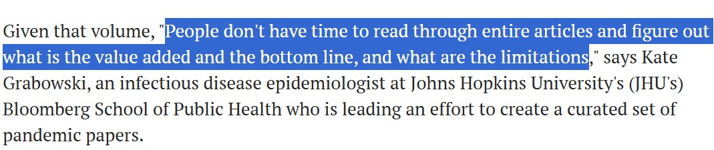
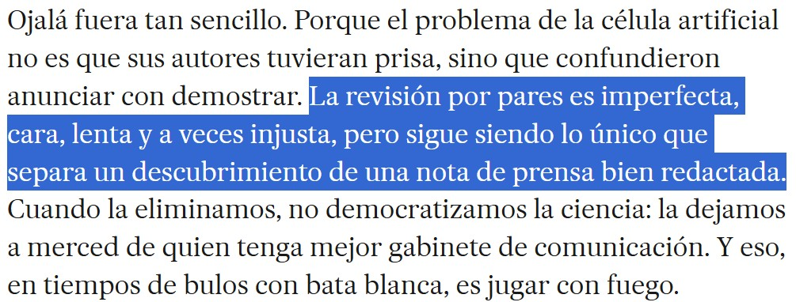
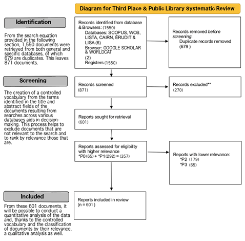
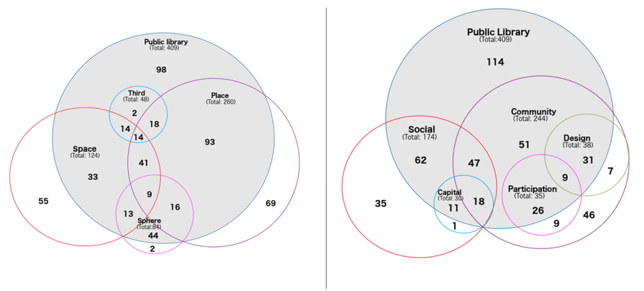
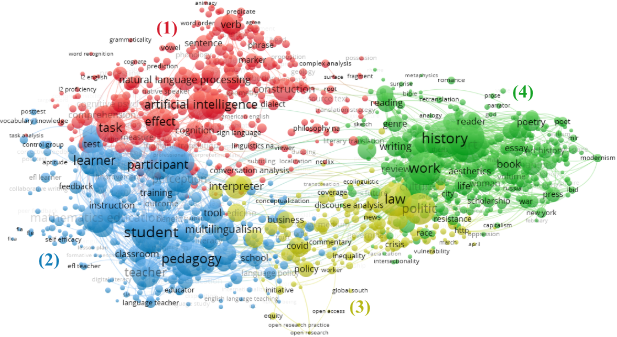
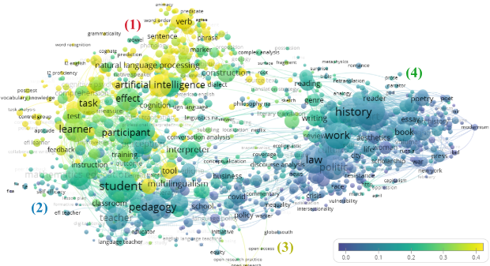

# Introducción {.unnumbered}

Este curso aborda una tarea común a todas las áreas y estadios en la carrera académica de toda investigadora. Esto es, el **proceso de revisión bibliográfica**. Ya sea porque estás redactando tu tesis, trabajando en un artículo de investigación o quieras  publicar una revisión de la literatura, en este curso mostraremos técnicas y cuestiones metodológicas y de presentación que pueden serte útiles.

Si te interesa el tema y quieres completar, te recomiendo otros cursos y materiales elaborados tanto por mí como otros compañeros relacionados con este curso:

-   [Revisiones sistemáticas para doctorandos. Recomendaciones (I)](https://yosigo.ugr.es/courses/revisiones-sistematicas-para-doctorandos-i/) de JJ Boté
-   [Técnicas de mapeo bibliográfico para llevar a cabo revisiones](https://yosigo.ugr.es/courses/tecnicas-de-mapeo-bibliografico-para-llevar-a-cabo-revisiones-ii-second-edition/) de Rubén Alba-Ruiz
-   [Técnicas esenciales para preparar una revisión bibliográfica](https://www.youtube.com/watch?v=iS3SbpYf98o) de Nicolás Robinson-García (versión 1.0 de este curso).

## Descripción de materiales {.unnumbered}

Los materiales están estructurados en 7 bloques y un apéndice en el que incluyo el uso específico de herramientas y software que pueden servir para ayudar en algunas partes del proceso. **Una buena revisión bibliográfica es el resultado de decisiones metodológicas conscientes**, donde las herramientas digitales son un apoyo a ese proceso crítico, no un sustituto.

| Bloque | Contenido |
|--------|-----------|
| 1 | Intro y objetivos del curso |
| 2 | Tipos de revisiones bibliográficas |
| 3 | La revisión sistemática |
| 4 | Búsqueda y selección |
| 5 | Proceso de lectura |
| 6 | Organización, síntesis y escritura |
| 7 | Consejos finales y cierre |
| A | Apéndices de herramientas de apoyo |

En los apéndices incluyo tres herramientas específicas:

- **Zotero**. Un gestor bibliográfico en Acceso Abierto, un básico para cualquier investigador/a
- **VosViewer**. Una herramienta de visualización de redes especialmente diseñada para trabajar con datos bibliográficos. También abierta.
- **NotebookLM**. Una de las herramientas de IA Generativa que ofrece Google, en este caso diseñada para trabajar en entornos cerrados de información. Muy útil para trabajar con datos controlados y también para labores docentes.

También hablaré de otras herramientas a lo largo de la sesión, tales como:

-   **Claude / ChatGPT** — asistencia en limpieza de corpus y análisis
-   **Bibliometrix** (R) — análisis bibliométrico avanzado

<!--chapter:end:index.Rmd-->

# Intro y objetivos del curso

## La sobrecarga informativa

El sistema de comunicación científica lleva ya un tiempo en crisis:

- Un sistema de publicación muy costoso y lento
- Un sistema de incentivos para la publicación muy cuestionado

|  |  |
|----|----|
| Crecimiento exponencial de publicaciones | [](https://doi.org/10.1126/science.abc7839) |
| Agotamiento del sistema de revisión por pares | [](https://elpais.com/opinion/2026-07-04/una-ciencia-sin-filtros.html) |

**¿Son necesarias las revisiones bibliográficas?**

| ✅ Más que nunca | ⛔ No más *please* |
|----|----|
| Excesivo número de publicación | Una nueva publicación no es la respuesta a demasiadas publicaciones |
| Fin de la revista como nodo vehicular | La calidad de muchas revisiones es cuanto menos dudosa |
| Necesidad de cribado | La IAG puede automatizar todo esto |

Esta situación ambivalente deja: una respuesta ambivalente:

- Hay un agotamiento por parte de las revistas, ya que el número de revisiones sistemáticas que reciben se ha incrementado enormemente.

- Si no hay un **valor añadido real** detrás de la revisión, estará abocada al fracaso. 😥

Esto tiene implicaciones directas para quien quiere hacer una revisión hoy:

- No basta con identificar un tema y sintetizar lo que se ha escrito sobre él.
- Es necesario **justificar explícitamente la necesidad** de la revisión: ¿qué *gap* cubre? ¿qué pregunta responde que no estaba respondida?
- La elección del tipo de revisión debe estar **al servicio de la pregunta**, no al revés.
- **Aplicar un protocolo como PRISMA sin una pregunta sólida detrás produce revisiones vacías, aunque formalmente correctas**.

::: aviso
ℹ️ **No hay atajos ni trucos. Sí hay flujos de trabajo eficientes y uso creativo de las herramientas y la tecnología.**
:::

## Tipos de revisión según objetivo

No todas las revisiones tienen el mismo objetivo, y eso condiciona todo lo demás: el alcance, la exhaustividad, la estructura y el tono. Antes de buscar una sola referencia, conviene tener clara la respuesta a esta pregunta.

| Objetivo | Consideraciones | Nivel de exhaustividad |
|:--:|----|:--:|
| **Capítulo de tesis** | Demostrar un amplio conocimiento del campo, desde sus inicios hasta los avances más recientes | Amplio e histórico |
| **Sección de artículo** | Justificar un vacío en la literatura sobre la cuestión específica que se va a analizar. Es una revisión dirigida | Acotado y dirigido |
| **Revisión como paper** | Resumir la información más reciente y actualizada acerca de un frente de investigación para ofrecer una agenda de futuro | Amplio y dirigido |

<!--chapter:end:01-intro-objetivos.Rmd-->

# Tipos de revisiones bibliográficas

No existe un único tipo de revisión bibliográfica. La elección del tipo adecuado depende de la **pregunta de investigación**, del **estado del campo** y de los **recursos disponibles**.

## Narrativa

La revisión narrativa es la forma más flexible y menos estandarizada. El autor selecciona y sintetiza literatura relevante sobre un tema sin seguir un protocolo explícito ni criterios de búsqueda sistemáticos.

**Cuándo usarla:**

1.  Para ofrecer una panorámica general de un campo y posicionarme dentro del mismo marcando el camino a seguir.
    - [**Science of Science**](https://doi.org/10.1126/science.aao0185). Los grandes líderes de un campo incipiente se posicionan como referencias internacionales.

    - [**Science of Team Science**](https://psycnet.apa.org/doi/10.1037/amp0000319)**.** Aquí se trata más bien de marcar la agenda de investigación de una nueva sub-disciplina.
2.  Para contextualizar un problema muy específico o identificar distintas posiciones, organizar literatura dispersa y establecer las líneas de trabajo a seguir. Aquí os pongo dos ejemplos propios que iremos analizando a lo largo del curso:
    - [**The woman researcher's tale**](https://doi.org/10.1002/asi.25012)**.** Centrado en estudios bibliométricos que analizan las diferencias de género en ciencia.

    - [**The use of informetric methods to study diversity in the scientific workforce**](https://doi.org/10.1162/qss_a_00367)**.** Aquí se revisan métodos bibliométricos aplicados exclusivamente a estudiar diversidad de perfiles científicos.

Este tipo de revisiones no sólo es una tipología documental, sino que sería la habitual revisión que se incluye en introducciones de artículos científicos y de tesis doctorales. Es también la tipología tradicional en Ciencias Sociales y Humanidades.

**Limitaciones:**

1.  La selección de fuentes puede ser sesgada, y los resultados son difícilmente reproducibles.
2.  En ocasiones se valora por el principio de autoridad (quién la escribe), de hecho, históricamente estas revisiones se escribían por encargo.
3.  Es clave justificar y delimitar muy bien tanto la pregunta de investigación como el valor añadido que aporta la revisión.

## Sistemática

La revisión sistemática sigue un **protocolo explícito y reproducible**: define a priori la pregunta, los criterios de búsqueda, las fuentes consultadas, y los criterios de inclusión y exclusión. El proceso queda documentado de forma que un investigador independiente podría replicarlo.

**Cuándo usarla:** cuando se necesita una síntesis exhaustiva y transparente sobre una pregunta específica. Es el estándar en ciencias de la salud (modelo Cochrane), pero se aplica cada vez más en ciencias sociales. Sigue una estructura IMRaD y tiene sus propias directrices — [**PRISMA**](https://www.prisma-statement.org/). En la propia web ofrecen muchos recursos y una descripción muy detallada del proceso de trabajo a seguir. *(El modelo PRISMA se desarrolla en profundidad en el Bloque 3.)*

**Limitaciones:**

1.  Aunque históricamente requería tiempo, recursos y rigor metodológico, cada vez es más automatizable.
2.  Muchas revisiones de este tipo son extremadamente superficiales y poco fundamentadas gracias a la proliferación de herramientas-receta.

## Meta-análisis

El meta-análisis incorpora técnicas estadísticas para **combinar cuantitativamente los resultados** de múltiples estudios. Requiere que los estudios incluidos sean suficientemente homogéneos en diseño y medidas de resultado.

Algunos ejemplos del uso de meta-análisis en Ciencias Sociales:

- [Brouwer et al. (1999)](https://doi.org/10.1007/s101130050007) sobre valoración contingente de humedales

- [Barrio y Loureiro (2010)](https://www.sciencedirect.com/science/article/abs/pii/S0921800909004650) sobre valoración de bosques.

::: nota
**¿Qué es una meta-regresión?** Es la técnica estadística central del meta-análisis: una regresión donde cada observación es un *estudio* (o una estimación dentro de un estudio, p. ej. un valor de disposición a pagar), la variable dependiente es el resultado que se quiere sintetizar (el efecto, el valor monetario, etc.) y las variables independientes son características metodológicas y contextuales de cada estudio (año, método de valoración, tamaño muestral, país, tipo de bien valorado...). Permite explicar por qué varían los resultados entre estudios y predecir un valor para un contexto nuevo — la base del *benefit transfer*.
:::

A diferencia de PRISMA (pensado originalmente para revisiones clínicas), el protocolo de referencia específico para meta-análisis en economía es el de la red **MAER-Net**, [Stanley et al. (2013)](https://doi.org/10.1111/joes.12008), actualizado en [Havránek et al. (2020)](https://doi.org/10.1111/joes.12363), que además de la búsqueda sistemática (donde PRISMA sigue siendo útil) cubre aspectos propios de la meta-regresión económica: sesgo de publicación, significancia económica (no solo estadística) y transformación de coeficientes entre estudios para hacerlos comparables.

**Limitaciones:** si los estudios primarios tienen sesgos o son heterogéneos, el meta-análisis los amplifica. En el caso específico del benefit transfer, además, se pierde el detalle contextual de cada valoración original al agregar — el propio "error de transferencia" es objeto de estudio en la literatura.

## Otras tipologías: Scoping review, mapping review

**Scoping review:** mapea la extensión y naturaleza de la literatura sobre un tema sin el objetivo de sintetizar evidencia de forma exhaustiva. Útil para identificar conceptos clave y lagunas.

**Mapping review:** similar a la scoping review, pero con mayor énfasis en la representación visual y cuantitativa de la distribución de la literatura.

## Elegir el tipo adecuado: la pregunta manda

La siguiente tabla ofrece una orientación rápida, no una receta:

| Pregunta / Objetivo                              | Tipo recomendado      |
|--------------------------------------------------|-----------------------|
| ¿Qué se sabe sobre X en general?                 | Narrativa             |
| ¿Qué evidencia existe sobre el efecto de X en Y? | Sistemática           |
| ¿Cuál es el tamaño del efecto de X sobre Y?      | Meta-análisis         |
| ¿Qué tipos de estudios existen sobre X?          | Scoping / Mapping     |
| ¿Cuáles son los debates y supuestos del campo X? | Crítica / Integradora |

::: nota
👣 **Nota:** En ciencias sociales, la frontera entre tipos de revisión es más porosa que en ciencias de la salud. Lo importante no es etiquetar correctamente el tipo, sino que la metodología elegida sea coherente con la pregunta y esté **justificada explícitamente**.
:::

## Dos revisiones narrativas reales: decisiones metodológicas y cómo defenderlas

Vamos a ver dos ejemplos concretos de revisiones narrativas. Ambas ilustran cómo se toman y se justifican decisiones metodológicas sin recurrir a PRISMA, y cómo responder a revisores que piden sistematización cuando no es necesaria ni adecuada.

### González-Salmón et al. (2025, JASIST)

Esta revisión cubre 246 publicaciones sobre métodos bibliométricos para estudiar el género en ciencia a lo largo de 30 años. Los autores eligen explícitamente la revisión **narrativa** por varias razones:

- El campo es metodológicamente heterogéneo: combinar estudios con diseños muy distintos en un protocolo sistemático habría forzado exclusiones arbitrarias.
- El objetivo es **organizar y sintetizar** un campo amplio, no responder a una pregunta clínica acotada.
- La revisión aporta valor añadido identificando gaps metodológicos y proponiendo una agenda futura — algo que PRISMA no facilita.

Aspectos a destacar: estructura temática en dos grandes bloques (metodología → hallazgos), uso de tablas comparativas para sintetizar métodos y resultados, y declaración explícita del alcance temporal y temático en la introducción.

### Robinson-Garcia et al. (2025, QSS)

Esta revisión examina más de 250 estudios sobre métodos infométricos para estudiar la diversidad en la fuerza laboral científica. También es narrativa, y la justificación es similar:

- Se trata de un campo con tradición propia en sociología de la ciencia, cienciometría y política científica — imponer PRISMA habría excluido literatura clave de algunas de estas tradiciones.
- La estructura se organiza por **áreas temáticas** (fuentes de datos, características individuales, contexto, dinámica de equipos), no por criterios de inclusión/exclusión.
- Las tablas comparativas (como la Tabla 1 comparando revisiones previas) sustituyen al diagrama de flujo PRISMA como herramienta de transparencia.

<!-- Nota de tiempo: este bloque reutiliza el 01-intro.Rmd de v1 casi al completo (incluidos los casos reales, por decisión explícita). Si 20 min se quedan cortos, los casos reales son lo primero recortable a "cita rápida" sin desarrollo. -->

<!--chapter:end:02-tipos-revision.Rmd-->

# La revisión sistemática

Los objetivos de una revisión sistemática:

1.  Sintetizar el estado del arte
2.  Responder a preguntas de investigación a las que estudios de manera aislada no pueden responder
3.  Identificar problemas sistémicos en la literatura para que se eviten en estudios posteriores
4.  Generar nuevas teorías o cuestionar o refinar teorías existentes

## El modelo PRISMA

PRISMA (Preferred Reporting Items for Systematic Reviews and Meta-Analyses) es el estándar más extendido para reportar revisiones sistemáticas. No es un protocolo de investigación en sí mismo, sino una **guía de reporte**: establece qué información debe incluirse en el manuscrito para que la revisión sea transparente y reproducible.

La versión vigente es **PRISMA 2020**, que actualizó la versión de 2009 para incorporar los cambios en las prácticas de revisión sistemática, incluyendo la búsqueda en registros de preprints y el uso de herramientas automatizadas.

### El diagrama de flujo PRISMA

El elemento más reconocible de PRISMA es su [diagrama de flujo](https://www.prisma-statement.org/prisma-2020-flow-diagram), que documenta el proceso de identificación, cribado y selección de estudios:



Sin embargo, esto es sólo parte de lo que comprende el modelo PRISMA. PRISMA cuenta con 27 ítems a considerar a la hora de realizar una revisión sistemática más 12 relacionados con la redacción del abstract. Asimismo cuenta con extensiones para tareas específicas. Destaco algunas:

- [**PRISMA-S**](materiales/PRISMA-S%20Checklist.pdf) (Search). Incluye un listado de 16 ítems de cara a reportar las ecuaciones de búsqueda, fuentes de información y criterios de inclusión empleados

- [**PRISMA-ScR**](materiales/PRISMA_ScR_Manuscript_July6th_clean_1_.pdf) (Scoping Reviews). Se trata de una revisión general sobre un tema específico para identificar conceptos, teorías o métodos clave, y determinar los principales retos o vacíos de conocimiento. Esta extensión incluye una checklist de 20 elementos más 2 opcionales.

- [**PRISMA-trAIce**](materiales/ai-2025-1-e80247.pdf) (Uso de la IA). Aunque existe un grupo de trabajo oficial trabajando en este tema, aquí incluyo una extensión no oficial en la que los autores proponen una checklist de ítems para declarar de manera responsable el uso de la IA generativa.

### PRISMA en ciencias sociales

El uso de PRISMA en ciencias sociales requiere algunas adaptaciones. La heterogeneidad metodológica de los estudios en ciencias sociales hace que los criterios de inclusión/exclusión sean más complejos y que la síntesis cuantitativa (meta-análisis) sea menos frecuentes. No obstante, esto lo recoge en el [propio documento](http://dx.doi.org/10.1136/bmj.n71) en el que lo describen.

En ciencias sociales es habitual usar **síntesis narrativa estructurada** en lugar de meta-análisis, con tablas de extracción de datos que permiten comparar estudios de forma sistemática aunque no cuantitativa.

## Protocolo de trabajo

El checklist de PRISMA reparte los 27 ítemes en 7 bloques, y cubre tanto las consideraciones **previas** a la recopilación de bibliografía (protocolo) como el análisis **posterior** (resultados y discusión):

+------------------+---------------------------------------------------------------------+---------------------------------------------+
| Bloque           | Qué cubre                                                           | Ítems PRISMA                                |
+==================+=====================================================================+:===========================================:+
| Título / Resumen | - Identificar el trabajo como revisión sistemática desde el título  | 1, 2                                        |
|                  |                                                                     |                                             |
|                  | - Redacción del resumen estructurado (checklist propia de 12 ítems) |                                             |
+------------------+---------------------------------------------------------------------+---------------------------------------------+
| Introducción     | - Justificación de la revisión                                      | 3, 4                                        |
|                  |                                                                     |                                             |
|                  | - Objetivos o pregunta explícita                                    |                                             |
+------------------+---------------------------------------------------------------------+---------------------------------------------+
| **Métodos**      | - Criterios de elegibilidad, fuentes de información                 | 5, 6, 7, 8, 9, 10a-b, 11, 12, 13a-f, 14, 15 |
|                  |                                                                     |                                             |
|                  | - Proceso de selección de fuentes                                   |                                             |
|                  |                                                                     |                                             |
|                  | - **Estrategia de búsqueda**                                        |                                             |
|                  |                                                                     |                                             |
|                  | - Recopilación y selección final de publicaciones                   |                                             |
|                  |                                                                     |                                             |
|                  | - Evaluación de riesgo de sesgos                                    |                                             |
|                  |                                                                     |                                             |
|                  | - Codificación y análisis de resultados                             |                                             |
+------------------+---------------------------------------------------------------------+---------------------------------------------+
| Resultados       | - Resultado del proceso de selección (el propio diagrama de flujo)  | 16a-b, 17, 18, 19, 20a-d, 21, 22            |
|                  |                                                                     |                                             |
|                  | - Características de los estudios                                   |                                             |
|                  |                                                                     |                                             |
|                  | - Resultados individuales y de síntesis, certeza de la evidencia    |                                             |
+------------------+---------------------------------------------------------------------+---------------------------------------------+
| Discusión        | - Interpretación de los hallazgos                                   | 23a-d                                       |
|                  |                                                                     |                                             |
|                  | - Limitaciones de la evidencia y de la revisión                     |                                             |
|                  |                                                                     |                                             |
|                  | - Implicaciones                                                     |                                             |
+------------------+---------------------------------------------------------------------+---------------------------------------------+
| Otra información | - Registro y protocolo previo                                       | 24a-c, 25, 26, 27                           |
|                  |                                                                     |                                             |
|                  | - Financiación                                                      |                                             |
|                  |                                                                     |                                             |
|                  | - Conflictos de interés                                             |                                             |
|                  |                                                                     |                                             |
|                  | - Disponibilidad de datos y código                                  |                                             |
+------------------+---------------------------------------------------------------------+---------------------------------------------+

Por eso, cuando se habla de "seguir PRISMA" no basta con documentar bien la ecuación de búsqueda: el mismo nivel de detalle se espera al describir cómo se extrajeron los datos, cómo se sintetizaron los resultados y cómo se reportan, con o sin metaanálisis de por medio.

## Codificación y análisis: una ventana abierta a la creatividad

PRISMA no dice cómo tienes que cribar, codificar o analizar tu corpus. El Ítem 8 (proceso de selección) es explícito al respecto: solo exige que reportes qué método usaste y cómo. **No prioriza el cribado manual frente al asistido por herramientas, ni al revés**. De hecho, contempla expresamente el uso de clasificadores de *machine learning* (como el Cochrane RCT Classifier) o el *priority screening* (reordenar registros por relevancia con IA) como opciones tan legítimas como el cribado manual tradicional.

Esto deja una puerta abierta: **la elección de cómo abordar la codificación y el análisis de tu corpus es una decisión metodológica más**, no un trámite con una única respuesta correcta. Combinar criterio manual con apoyo computacional, en la medida que tu corpus, tus recursos y tu pregunta lo permitan, es perfectamente válido siempre que lo documentes.

Algunas posibilidades, varias de las cuales ya se han mencionado a lo largo del curso:

+----------------------------------------+---------------------------------------------------+------------------------------------------------------------------------------------------------------------+
| Tarea                                  | Enfoque manual                                    | Apoyo computacional / IA                                                                                   |
+========================================+===================================================+============================================================================================================+
| Selección de estudios (cribado)        | Un revisor, o dos con resolución de discrepancias | Clasificadores de ML, *priority screening*, crowdsourcing (contempladas explícitamente por PRISMA, Ítem 8) |
+----------------------------------------+---------------------------------------------------+------------------------------------------------------------------------------------------------------------+
| Gestión y deduplicación de referencias | Revisión manual de duplicados                     | Zotero (ver \@ref(zotero)): deduplicación automática y limpieza asistida por LLM                           |
+----------------------------------------+---------------------------------------------------+------------------------------------------------------------------------------------------------------------+
| Codificación / extracción de datos     | Hoja de codificación manual, artículo a artículo  | LLMs (ChatGPT/Claude) como asistentes de extracción acotada y supervisada                                  |
+----------------------------------------+---------------------------------------------------+------------------------------------------------------------------------------------------------------------+
| Estructura temática del corpus         | Lectura y agrupación manual por temas             | Vosviewer (ver \@ref(vosviewer)): (mapas de co-ocurrencia) o Bibliometrix (análisis avanzado en R)         |
+----------------------------------------+---------------------------------------------------+------------------------------------------------------------------------------------------------------------+
| Lectura y síntesis dirigida            | Lectura completa, artículo a artículo             | NotebookLM (ver \@ref(notebooklm)) para interrogar el corpus con prompts dirigidos                         |
+----------------------------------------+---------------------------------------------------+------------------------------------------------------------------------------------------------------------+

Para el detalle práctico de Zotero, VOSviewer, Bibliometrix y NotebookLM —instalación, flujo de trabajo, prompts de ejemplo— ver el **Apéndice: Herramientas de apoyo**.

<!--chapter:end:03-revision-sistematica.Rmd-->

# Búsqueda y selección

Antes de ponernos a buscar, conviene tener claro el objetivo: no se trata de recopilar todo lo que existe sobre un tema, sino de construir un **corpus representativo, manejable y bien documentado** que permita responder a la pregunta de investigación.

## Acotación del tema

Antes de lanzar una sola búsqueda, conviene fijar por escrito los límites de tu revisión. Todos estos criterios deben derivarse de tu pregunta de investigación, no al revés:

- **Ventana temporal**. ¿Desde cuándo? ¿Existe un evento fundacional del campo (una publicación seminal, un cambio metodológico) que justifique un año de corte? ¿Hasta cuándo? ¿Incluyes preprints o solo publicado?

- **Tipología documental**. ¿Solo artículos revisados por pares? ¿Incluyes actas de congreso, capítulos de libro, tesis, literatura gris? Cuanto más aplicada/emergente sea el área, más justificado está ampliar más allá del artículo journal.

- **Idioma**. Restringir a inglés es habitual pero introduce sesgo, sobre todo si el tema tiene tradición local (p. ej. economía ambiental en Latinoamérica).

- **Criterios metodológicos**. ¿Excluyes ciertos diseños de estudio (p. ej. solo cuantitativos, o solo estudios con datos primarios)?

- **Relación con el tipo de revisión** . Una narrativa admite ajustar estos criterios sobre la marcha; una sistemática exige fijarlos a priori y documentarlos.

::: nota
👣 Regla práctica: si no puedes escribir cada criterio en una frase y justificar por qué existe, probablemente no está lo bastante pensado todavía.
:::

El **tipo de revisión** que vas a emplear determina la estrategia de búsqueda a seguir.

- **Revisiones sistemáticas:** Protocolo de trabajo claro y reproducible donde la clave está en la ecuación de búsqueda empleada.

- **Revisiones narrativas:** Protocolo más flexible, aunque no por ello significa que no se permita la introducción de fórmulas innovadoras y transparentes. Si somos rigurosos desde el principio, dejaremos en cada paso rastro documental, *lo que permitirá justificar más adelante si fuera necesario*.

Debido a la proliferación de revisiones sistemáticas, en ocasiones algún revisor insiste en indicar la metodología y estrategia de búsqueda. Si no hemos llevado cuenta de ese registro documental, alguna alternativa que he empleado es esta que aquí indico:

[](https://doi.org/10.1002/asi.25012)

### ¿Cómo ajustar el tamaño del corpus bibliográfico?

Una vez tienes una primera ecuación de búsqueda, rara vez el resultado tiene el tamaño adecuado a la primera. Dos escenarios opuestos, dos estrategias:

**Si el corpus es demasiado pequeño (expandir)**:

1.  **Citas y referencias** de los textos ya identificados (snowballing): revisar tanto qué citan (backward) como quién les cita a ellos (forward, vía Google Scholar o WoS "Cited by").

2.  **Palabras clave** de los textos seleccionados: términos que los propios autores usan y que tú no habías anticipado, señal de vocabulario del campo que falta en tu ecuación.

3.  **Uso de tesauros o vocabularios controlados** del área, si existe (p. ej. [EconLit](https://www.aeaweb.org/jel/guide/jel.php)), como fuente adicional de términos, complementaria a las keywords que extraes de los propios textos. Esto es un clásico en el ámbito biomédico con los encabezamientos [MeSH](https://www.nlm.nih.gov/mesh/meshhome.html).

4.  **Revistas núcleo**: identificar qué revistas concentran más publicaciones sobre el tema y revisar sus números/índices directamente, más allá de la ecuación de búsqueda.

::: nota
Según la **Ley de Bradford**, para cualquier tema de investigación, será un pequeño núcleo de revistas el que concentre alrededor de un tercio de los documentos relevantes. Le sigue una zona más amplia de revistas que produce otro tercio; y una zona aún mayor de revistas dispersas produce el tercio restante. Es la justificación bibliométrica de por qué "buscar en las revistas núcleo" es una estrategia razonable.
:::

5.  **Criterio de saturación**: sabrás que puedes parar de expandir cuando nuevas búsquedas o nuevas fuentes ya no aporten documentos nuevos relevantes; especialmente útil en revisiones narrativas, donde no hay un punto de corte formal como en una sistemática.

**Si el corpus es demasiado grande (restringir)**:

1.  **Afinar el nivel de detalle**: pasar de buscar en texto completo a título/abstract/keywords, o añadir un segundo bloque de términos con `AND`.

2.  **Bibliographic coupling para identificar el núcleo**: dos documentos están acoplados si citan referencias comunes; los documentos con mayor acoplamiento entre sí suelen ser el núcleo temático real del campo, lo que permite descartar resultados periféricos o ruido. Aquí hay herramientas bibliométricas como [CitNetExplorer](https://www.citnetexplorer.nl) que permiten visualizar la red de citas y aislar clusters de publicaciones *acopladas*.

::: aviso
**Snowballing vs. bibliographic coupling**: el primero expande (vas hacia fuera desde tu corpus semilla); el segundo restringe (identifica qué parte de tu corpus ya recopilado es realmente núcleo). Se pueden combinar de forma iterativa.

**VOSviewer vs. CitNetExplorer**: no son lo mismo aunque se usen juntos a menudo. VOSviewer mapea co-ocurrencia de términos: de qué habla el corpus. CitNetExplorer estructura la red de citas: cómo se relacionan los documentos entre sí y cuál es su núcleo. Uno responde "qué temas hay", el otro "qué es central".
:::

## Selección de fuentes

**No existe una base de datos perfecta.** La elección depende del campo, del tipo de literatura que interesa y de los recursos disponibles. Para ciencias sociales, las tres fuentes principales son:

### Web of Science (WoS)

| Ventajas | Limitaciones |
|----|----|
| Alta calidad y selectividad en la indexación. | Cobertura limitada de literatura en español y de revistas latinoamericanas o temáticas de carácter local |
| Excelente cobertura de revistas de alto impacto en ciencias sociales a nivel internacional | No cubre literatura gris ni tesis doctorales |
| Permite búsquedas muy precisas con operadores booleanos avanzados | Acceso restringido (requiere suscripción institucional) |
| Exportación limpia y estructurada (compatible con Zotero y VOSviewer directamente) | Sesgo hacia ciencias naturales y biomedicina en detrimento de humanidades |
| Datos de citación fiables y completos |  |

### Scopus

| Ventajas | Limitaciones |
|----|----|
| Mayor cobertura que WoS en número de revistas, especialmente en ciencias sociales y humanidades | Acceso restringido (requiere suscripción institucional) |
| Buena cobertura de literatura en español e iberoamericana | La mayor cobertura implica también mayor variabilidad en calidad |
| Interfaz de búsqueda potente y flexible | Datos de citación algo menos fiables que WoS para análisis bibliométricos precisos |
| Exportación estructurada compatible con Zotero y VOSviewer |  |

### Google Scholar

| Ventajas | Limitaciones |
|----|----|
| Acceso gratuito y universal | No permite exportación masiva directa (límite de \~1000 resultados con Publish or Perish) |
| Cobertura amplísima: incluye preprints, tesis, literatura gris, libros y capítulos | Calidad de metadatos muy variable: errores frecuentes en autores, años y títulos |
| Muy útil para campos emergentes o con literatura dispersa | No ofrece operadores booleanos avanzados comparables a WoS/Scopus |
| Imprescindible para detectar literatura en español no indexada en WoS/Scopus | Los resultados no son reproducibles: varían según el usuario, la sesión y el momento |

### OpenAlex

| Ventajas | Limitaciones |
|----|----|
| Completamente gratuito y abierto (datos y API), sin restricción de suscripción institucional | Metadatos de afiliación incompletos o ausentes en una proporción muy alta de registros, especialmente en ciencias sociales y humanidades |
| Cobertura muy amplia: integra Crossref, PubMed, ORCID, ROR, ISSN-L y otras fuentes en un único grafo de identificadores | Calidad de metadatos desigual: faltan abstracts, referencias o tipo de documento en muchos registros |
| API abierta y bien documentada, ideal para descargas masivas y análisis reproducibles en R/Python | Identificación del idioma del documento poco fiable — tiende a sobreestimar la proporción de documentos en inglés |
| Buena cobertura de identificadores (ORCID, DOI, ROR) que facilita el cruce con otras bases | Cobertura de citas comparable a WoS/Scopus en años recientes (2015-2022), pero con salvedades por campo y por región |
| Adopción creciente como alternativa abierta a bases comerciales, particularmente en el Sur Global | Al ser una base más joven y en constante actualización, la reproducibilidad exacta de una búsqueda puede variar entre extracciones |

::: nota
👣 **Recomendación:** Para una revisión en ciencias sociales, combinar WoS + Scopus como fuentes principales y Google Scholar + OpenAlex como fuentes complementarias para detectar literatura no indexada. Documentar siempre la fecha de búsqueda y la cadena de búsqueda exacta utilizada en cada base de datos.
:::

## Diseño de búsqueda

### La clásica para revisiones sistemáticas

Una buena estrategia de búsqueda equilibra **sensibilidad** (no perderse nada relevante) y **especificidad** (no obtener miles de resultados irrelevantes). El flujo clásico PRISMA es el siguiente:

1.  Identifico los términos de búsqueda esenciales, considerando: sinónimos, variantes ortográficas y términos en inglés y español.

2.  Combino los términos seleccionados empleando **operadores booleanos** y **operadores de truncamiento**, y diseño mi ecuación de búsqueda.

    {width="561"}

3.  **Evalúo y analizo los resultados** para valorar la pertinencia de los términos, eliminar y sustituir términos ambiguos, añadir otros términos relacionados, etc. Repito pasos 2 y 3 hasta estar satisfecho con la ecuación de búsqueda y los resultados obtenidos.

::: aviso
**Truncamiento:** el asterisco `*` permite recuperar variantes de una raíz. Por ejemplo, `academ*` recupera *academic*, *academics*, *academically*, etc. Si se quiere controlar que varíe una sóla letra, se emplea el `?`

**Campos de búsqueda:** Es importante delimitar también los campos sobre los que se lanza la ecuación de búsqueda. Por ejemplo, `Title-Abstract-Keywords`. Buscar solo en título es más preciso pero puede perder resultados relevantes; buscar en texto completo genera demasiado ruido.
:::

#### Variante A. El uso de ontologías

Una variante interesante, es la de organizar esos términos de búsqueda por niveles y crear nuestra ontología específica para poder *trocear* nuestro corpus bibliográfico por distintos aspectos o conceptos a analizar. Aquí te incluyo un ejemplo del trabajo de [Mir-Planells et al. (2026)](https://doi.org/10.3145/infonomy.26.021), donde usaba un **vocabulario controlado** con el que identificaba distintos conjuntos de documentos en base a búsquedas temáticas y luego *mapeaba* el solapamiento entre los mismos.

{width="614"}

Aunque supone hacer muchas búsquedas por separado, permite luego analizar relaciones entre términos y conceptos de manera muy visual.

#### Variante B. Mapeo y zoom

Otra opción, es la de trabajar sobre un corpus bibliográfico más amplio que nuestro objeto de estudio. En el ejemplo que os pongo a continuación, lo que hacemos es trabajar con documentos de un listado de revista del área de Traducción y después identificar en qué áreas se hablar sobre IA Generativa, con el objetivo de revisar después, cómo se está abordando el uso de la IAG en esta disciplina.



Este mapa está hecho con **VOSviewer** (ver Apéndice). Con esta herramienta podemos *superponer* mapas, lo que se conoce como mapas *overlay* para cruzar la información que ofrece la red de términos con otras variables. En este caso, la relación de los términos que se emplean con términos relacionados a la IAG.



### Revisiones narrativas

En estos casos, la rigurosidad y necesidad de protocolo preestablecido no es tan necesaria, por lo que se combinan de manera muy informal diferentes estrategias de búsqueda. Aquí os enumero algunas:

- **Clásica búsqueda en bases de datos**, siguiendo una aproximación similar a la estrategia anterior.

- **Serendipia**, algo esencial en la ciencia, aunque muchas veces se nos olvide. Y si no, [mírate este paper](https://doi.org/10.1016/j.respol.2017.10.007) 😉.

- **Búsqueda por autores/escuelas.** En muchos casos, identificar a las referencias del área es vital para poder identificar su trabajo y analizar su evolución más allá de los términos que hayan empleado para describir estos trabajos.

- **Navegación a través de citas y referencias.** Muy útil a la hora de expandir nuestro corpus. También puede emplearse (aunque con algunas precauciones) esta estrategia en las revisiones sistemáticas.

## El corpus limpio: qué tenemos al final de este bloque

Al terminar el proceso de búsqueda, importación y deduplicación (gestión de referencias con Zotero — ver Apéndice), debemos tener:

- Un **recuento documentado** de registros por base de datos (imprescindible para PRISMA)
- Un corpus de referencias sin duplicados, organizado en Zotero
- Los metadatos básicos completos: título, autores, año, revista, DOI, abstract

Este corpus es el punto de partida tanto para el proceso de lectura (Bloque 5) como para el análisis con las herramientas de apoyo documentadas en el Apéndice (VOSviewer, NotebookLM).

<!-- Corregido respecto a v1: el cierre original decía "este corpus es el punto de partida para los dos bloques siguientes: NotebookLM y VOSviewer", lo cual ya no aplica porque esas herramientas pasan al Apéndice y no son "los bloques siguientes" en esta edición. -->

<!--chapter:end:04-busqueda-seleccion.Rmd-->

# Proceso de lectura

No todos los artículos de un corpus merecen el mismo nivel de atención. Una gestión eficiente del tiempo de lectura implica distinguir dos velocidades:

## Lectura en dos velocidades

<!-- Nota de renombrado: en v1 la columna se llamaba "Lectura de cribado". Por decisión explícita, "Lectura dirigida" = la misma "lectura de cribado" (título, abstract, conclusiones para decidir relevancia), solo cambia el nombre. No es contenido nuevo. -->

| Lectura dirigida | Lectura profunda |
|------------------------------------|------------------------------------|
| Título, abstract y conclusiones | Texto completo, incluyendo metodología, resultados y discusión |
| **Objetivo:** decidir si el artículo es relevante para la pregunta de investigación | **Objetivo:** extraer datos, evaluar calidad metodológica, comprender argumentos. Reservada para los artículos que superan la lectura dirigida |
| **Tiempo estimado:** 2-5 minutos por artículo | **Tiempo estimado:** 30-90 minutos por artículo |

El análisis con VOSviewer y NotebookLM (ver Apéndice) ayuda a priorizar qué artículos merecen lectura profunda y cuáles pueden quedar en lectura dirigida.

### Cómo abordar la lectura profunda: lectura por pasadas

"Texto completo" no significa leer de principio a fin en una sola sesión. Una técnica extendida en metodología de investigación es leer en pasadas sucesivas, ganando profundidad solo cuando el artículo lo justifica:

- **Pasada 1:** título, abstract, figuras/tablas y conclusiones: ¿vale la pena seguir? 🤔
- **Pasada 2:** metodología y resultados en detalle.
- **Pasada 3 (solo si el artículo es clave para tu revisión):** reconstruir el argumento completo y revisar las referencias propias del autor.

Otra opción es lo que hizo [Forchino et al., (2026)](https://doi.org/10.5281/zenodo.20643687), donde emplea técnicas bibliométricas para hacer una descripción general del campo y luego selecciona un *core* de documentos que analiza de manera cualitativa. Lo que ella llama un **diseño mixto secuencial**.

::: nota
👣 La mayoría de artículos de tu corpus solo necesitarán la Pasada 1 o 2. Reservar la Pasada 3 para un puñado de referencias centrales es lo que hace manejable la lectura profunda de un corpus grande.
:::

## Toma de notas

Una buena toma de notas durante la lectura profunda es la base de una síntesis de calidad. Algunos principios:

- Tomar notas en tus propias palabras, no copiando frases del artículo
- Registrar siempre la referencia completa junto a cada nota
- Distinguir entre lo que dice el autor y tu propia interpretación
- Anotar preguntas y dudas que surjan durante la lectura
- Registrar las limitaciones que el propio autor reconoce

**Herramientas útiles:**

- Zotero permite añadir notas a cada referencia, lo que mantiene todo centralizado (ver Apéndice)

- NotebookLM permite construir notas acumulativas vinculadas al corpus (ver Apéndice)

- Una hoja de extracción de datos (en Excel o Google Sheets) para sistematizar la información entre artículos. Un ejemplo mínimo de columnas:

  | Autor/Año | Método | Muestra | Hallazgo principal | Limitación declarada |
  |---------------|---------------|---------------|---------------|---------------|
  | Ejemplo (2023) | Encuesta transversal | N=340 | Correlación positiva X-Y | Muestra no representativa |


<!--chapter:end:05-lectura.Rmd-->

# Organización, síntesis y escritura

## Estructuras posibles

No existe una única estructura correcta para una revisión bibliográfica. La estructura debe estar al servicio de la pregunta y del tipo de revisión. Algunas opciones habituales:

### Estructura temática

Organiza la revisión en secciones correspondientes a los grandes temas o subtemas identificados en el corpus. Es la más habitual en revisiones narrativas y en revisiones sistemáticas con síntesis narrativa.

**Cuándo usarla:** cuando el objetivo es mapear la diversidad temática del campo. Los clusters de VOSviewer y las agrupaciones de NotebookLM (ver Apéndice) pueden ser un buen punto de partida para definir las secciones.

### Estructura cronológica

Organiza la revisión siguiendo la evolución histórica del campo. Útil para mostrar cómo ha cambiado la comprensión de un fenómeno o cómo han evolucionado los debates.

**Cuándo usarla:** cuando el objetivo es mostrar el desarrollo histórico de un campo o cuando hay un punto de inflexión claro (un evento, una publicación seminal, un cambio de paradigma) que estructura la narrativa.

### Estructura metodológica

Organiza la revisión según los enfoques metodológicos de los estudios incluidos (cuantitativos, cualitativos, mixtos; experimentales, observacionales, etc.).

**Cuándo usarla:** cuando el objetivo es evaluar críticamente cómo se ha estudiado un fenómeno, no solo qué se ha encontrado.

### Estructura por pregunta o hipótesis

Organiza la revisión en torno a las subpreguntas que componen la pregunta de investigación principal, respondiendo cada una en una sección.

**Cuándo usarla:** en revisiones sistemáticas con preguntas bien delimitadas.

### Un ejemplo de revisión asistida por IA

> Robinson-Garcia, N., van Schalkwyk, F., Tirado, M. M., Pham, V., & Melkers, J. (2024). What's in a team? Variability and discrepancies in the conceptualization and operationalization of scientific teams (Versión 1). 28th International Conference on Science, Technology and Innovation Indicators (STI 2024), Berlin. Zenodo. <https://doi.org/10.5281/zenodo.12726921>

En este trabajo de congreso, queríamos analizar qué se entiende por **equipo científico** en la literatura de evaluación de la ciencia y cienciometría. Para ello, seguimos la siguiente estrategia

**Selección del corpus.** Hicimos dos búsquedas en WoS:

1.  En la primera buscábamos sólo revisiones sobre equipos científicos
2.  En la segunda buscábamos artículos pero sólo publicados en la revista *Research Evaluation*. A partir de los resultados, identificamos los estudios más co-citados (al menos 3 co-citas), lo que nos redujo el set de datos a 46 publicaciones.

Tres investigadores revisamos de forma independiente y manual buscando definiciones explícitas de equipo científico, reduciendo el corpus final a **26 publicaciones**.

**Codificación manual.** Antes de recurrir al LLM, codificamos manualmente cada publicación en busca de definiciones y atributos de los equipos científicos. Este proceso por múltiples codificadores permitió contrastar después los resultados con los del modelo.

**Uso de GPT-4.** Sobre ese corpus de 26 estudios, utilizamos GPT-4 para tres tareas acotadas por documento:

1.  Evaluar el nivel de acuerdo con la codificación manual.
2.  Extraer la definición explícita de equipo con indicación de página
3.  Inferir los atributos esenciales que debe tener un equipo científico.

Tras el análisis individual, lanzamos un análisis global para formular una definición unificada e identificar atributos comunes y discrepancias.

Tres aspectos de este uso merecen atención:

-   **Supervisión explícita.** El proceso fue supervisado en todo momento y las respuestas del modelo fueron corregidas cuando fue necesario.
-   **Transparencia total.** La conversación completa con ChatGPT fue publicada y está disponible públicamente, haciendo el proceso replicable.
-   **Uso acotado.** El LLM no redactó ni sintetizó de forma autónoma: se usó como herramienta de extracción y codificación asistida sobre un corpus previamente seleccionado y revisado.

::: nota
Este ejemplo ilustra la distinción entre usar un LLM como **asistente de análisis** — con tareas definidas, supervisión constante y reporte transparente — y usarlo como **sustituto del análisis**. El valor añadido del investigador está en el diseño del proceso, la supervisión y la interpretación final.
:::

## Errores típicos

### Errores de estructura y enfoque

-   **El "laundry list":** enumerar estudios uno tras otro sin síntesis ni argumento. La revisión no es un catálogo; es una argumentación.
-   **Ausencia de hilo conductor:** el lector no entiende qué pregunta responde la revisión ni cómo cada sección contribuye a responderla.
-   **Desequilibrio entre descripción y análisis:** dedicar demasiado espacio a describir qué dice cada estudio y poco a analizarlo críticamente.

### Errores de selección y cobertura

-   **Sesgo de confirmación:** seleccionar preferentemente estudios que apoyan la posición del autor.
-   **Descuidar literatura contradictoria:** omitir estudios que ofrecen resultados o interpretaciones contrarias a la conclusión principal.
-   **Cobertura temporal desactualizada:** no incluir literatura reciente relevante.
-   **Sesgo lingüístico:** incluir solo literatura en inglés cuando existe literatura relevante en otros idiomas.

### Errores de síntesis

-   **Generalizar en exceso:** extraer conclusiones más amplias de lo que la evidencia revisada permite.
-   **Ignorar el contexto:** presentar hallazgos de contextos muy específicos como si fueran universales.
-   **No evaluar la calidad metodológica:** tratar todos los estudios como equivalentes independientemente de su rigor.

### Errores formales

-   **Citar sin leer:** incluir referencias que no se han leído directamente (citas de segunda mano no identificadas como tales).
-   **Confundir citación y atribución:** atribuir a un autor una afirmación que en realidad está en otro artículo.

## El proceso de escritura

### Escribir antes de "tener todo"

Un error frecuente es esperar a haber leído todo el corpus para empezar a escribir. La escritura es también un proceso de clarificación del pensamiento. Algunas estrategias:

-   Escribir resúmenes de cada artículo inmediatamente después de leerlo, mientras está fresco
-   Escribir borradores de sección aunque estén incompletos — se pueden rellenar después
-   Usar las notas de NotebookLM como punto de partida para el borrador (ver Apéndice)

### El papel de los LLMs en la escritura

Los LLMs pueden ser útiles en varias fases del proceso de escritura:

**Útil:**

-   Mejorar la redacción y claridad de párrafos ya escritos
-   Sugerir alternativas de formulación para ideas propias
-   Detectar inconsistencias o falta de claridad en la argumentación
-   Revisar la coherencia lógica entre secciones

**No adecuado:**

-   Generar el texto de síntesis directamente (el conocimiento sobre el corpus es del investigador, no del modelo)
-   Sustituir el análisis crítico propio
-   Redactar la discusión o las conclusiones sin control exhaustivo del investigador

### Revisión y cierre

Antes de considerar un borrador terminado, conviene revisar explícitamente:

-   ¿Cada sección responde a la pregunta de investigación o se desvía?
-   ¿Las conclusiones están sustentadas por la evidencia presentada?
-   ¿Se han reconocido las limitaciones de la propia revisión?
-   ¿El diagrama PRISMA es coherente con el texto?
-   ¿Todas las referencias citadas en el texto están en la bibliografía y viceversa?

<!--chapter:end:06-organizacion-sintesis-escritura.Rmd-->

# Consejos finales y cierre

-   **Una revisión es un argumento, no un resumen.** El valor está en lo que tú aportas al interpretar y sintetizar la literatura, no en la cantidad de artículos citados.
-   **La transparencia metodológica es parte de la calidad.** Documentar el proceso (incluyendo las herramientas usadas y cómo se usaron) no es burocracia — es rigor.
-   **Las herramientas cambian, los principios no.** NotebookLM, VOSviewer y Zotero son herramientas del momento (ver Apéndice para el detalle práctico de cada una). Los principios de una buena pregunta de investigación, una búsqueda transparente y una síntesis crítica son más duraderos.
-   **Compartir el protocolo antes de empezar** — aunque sea en un documento de trabajo interno — obliga a pensar con claridad sobre qué se quiere hacer y protege frente a la deriva durante el proceso.

<!-- TODO (opcional, no crítico): valorar si aquí quieres añadir un cierre específico para esta sesión de 2h, p.ej. remitiendo explícitamente al Apéndice y/o a la v1 completa (enlace a los cursos recomendados de index.Rmd) para quien quiera profundizar en VOSviewer/NotebookLM/Zotero. -->

<!--chapter:end:07-consejos-cierre.Rmd-->

# (APPENDIX) Apéndices {-}

# Herramientas de apoyo: VOSviewer, NotebookLM y Zotero {-}

> **Nota:** Este apéndice recoge en detalle herramientas que pueden ser especialmente útiles en la elaboración y análisis de resultados de cara a una revisión bibliográfica.

| Apartado | Descripción |
|----------|-------------|
| A | Zotero: Gestión bibliográfica |
| B | VosViewer: Visualización temática |
| C | NotebookLM para cribado de lecturas |

# Zotero: Gestión bibliográfica {#zotero}

Zotero es un gestor de referencias gratuito y de código abierto que permite importar, organizar y exportar referencias bibliográficas. Es la herramienta central de este flujo de trabajo.

## Instalación

1.  Descargar Zotero desde [zotero.org](https://www.zotero.org/download/)
2.  Instalar el conector para el navegador (disponible para Chrome y Firefox) — permite guardar referencias directamente desde la web
3.  Crear una cuenta gratuita en zotero.org (permite sincronización y hasta 300 MB de almacenamiento gratuito)

## Configuración recomendada para revisiones sistemáticas

Antes de importar, crear una **biblioteca de grupo separada** para cada revisión. Esto facilita el conteo de registros por base de datos y mantiene la biblioteca personal limpia.

Dentro de la biblioteca, crear una colección por base de datos:

```
📁 [TEMA A ANALIZAR]
   📂 WoS
   📂 Scopus
   📂 Google Scholar
```

## Deduplicación de registros

Al importar desde varias bases de datos, es inevitable que algunas referencias aparezcan en más de una. La deduplicación elimina estas repeticiones.

### Deduplicación automática en Zotero

Zotero identifica duplicados comparando título, DOI y año de publicación. Para acceder a la vista de duplicados:

1.  En el panel izquierdo, hacer clic en *Elementos duplicados*
2.  Aparecerán agrupados los registros que Zotero considera duplicados
3.  Para cada grupo: seleccionar el registro *maestro* (el que tiene metadatos más completos) y hacer clic en *Combinar elementos*

**Limitación importante:** Zotero no permite combinar todos los duplicados de una vez — hay que hacerlo grupo a grupo. Para bibliotecas grandes, el plugin **Zoplicate** acelera este proceso.

::: aviso
**Precaución:** No todos los elementos que Zotero identifica como duplicados lo son realmente. Un artículo de conferencia y su versión publicada en revista pueden tener títulos similares sin ser el mismo trabajo. Revisar siempre antes de combinar.
:::

### Limpieza asistida por LLM

La deduplicación automática de Zotero no detecta todos los casos problemáticos. Algunos ejemplos habituales:

-   Mismo artículo con ligeras variaciones en el título (preprint vs. versión publicada)
-   Mismo autor con variantes ortográficas del nombre
-   Metadatos incompletos o erróneos que impiden la detección automática

Para estos casos, se puede exportar la biblioteca a bibtex (`Archivo → Exportar biblioteca → bib`) y usar un LLM para identificar duplicados no obvios.

**Ejemplo de prompt para Claude:**

```
Tengo una lista de referencias bibliográficas exportadas de Zotero en bibtex.
Necesito identificar posibles duplicados que no fueron detectados
automáticamente. Pueden ser duplicados por:
- Mismo artículo con título ligeramente diferente (preprint vs publicado)
- Mismo trabajo con metadatos incompletos en una de las versiones
- Variantes en el nombre del autor

Por favor, analiza las siguientes referencias y señala los pares o grupos
que podrían ser el mismo trabajo, indicando por qué lo sospechas:

[PEGAR REFERENCIAS EN CSV]
```

El LLM no toma decisiones por el investigador — sugiere candidatos a revisar. La decisión final es siempre humana.

::: nota
**También existen plugins de IA para Zotero**. Son opciones a explorar para flujos de trabajo más avanzados, aunque requieren clave de API propia o suscripción. No he llegado a probarlos
:::

# VOSviewer: Visualización temática {#vosviewer}


VOSviewer es una herramienta gratuita desarrollada por el Centre for Science and Technology Studies (CWTS) de la Universidad de Leiden para la **construcción y visualización de redes bibliométricas**. Permite representar visualmente la estructura intelectual de un campo de investigación a partir de los metadatos de un corpus bibliográfico.

A diferencia de NotebookLM, que analiza el *contenido* de los textos, VOSviewer analiza las *relaciones entre elementos bibliométricos*: términos, autores, revistas, referencias. Es una herramienta complementaria, no alternativa.

Descarga gratuita: [vosviewer.com](https://www.vosviewer.com)

VOSviewer puede construir varios tipos de redes. Para este curso nos centraremos en la más útil para revisiones en ciencias sociales:

-   **Co-ocurrencia de términos.** Establece relaciones entre términos en base a las veces que aparecen de manera conjunta en distintos documentos.

-   **Co-autoría.** Permite analizar redes de colaboración entre autores en base a su co-ocurrencia en distintos documentos.

-   **Co-citación.** Dos artículos estarán relacionados entre sí si son citados con frecuencia de manera conjunta en otros trabajos.

-   **Acoplamiento bibliográfico:** Dos artículos estarán relacionados entre sí, si tienden a citar en su listado de referencias los mismos trabajos.

## Importación de datos en VOSviewer

VOSviewer trabaja con datos bibliográficos y texto en distintos formatos. Puede trabajar con tres tipos de ficheros esencialmente:

1.  **Ficheros extraídos desde una base de datos bibliográfica.** Soporta bases de datos tipo Web of Science, Scopus, OpenAlex o Dimensions entre otras. En algunos casos incluso permite trabajar directamente desde la API de la base de datos.
2.  **Ficheros exportados de un gestor bibliográfico.** También permite trabajar con ficheros en formato .ris o .bib extraídos por ejemplo, de Zotero.
3.  **Texto plano.** Para mapas de co-palabras se puede trabajar directamente con ficheros de texto donde cada línea representa un documento.

### Nuestro set de datos

Para esta pequeña práctica he preparado un set de datos de 1360 documentos extraídos de la Web of Science y relacionados con el uso responsable de la IA en el entorno universitario. Esta es la estrategia de búsqueda que he empleado:

```
(generative AI OR ChatGPT OR LLM) AND ("higher education" OR universit*) AND (ethic* OR “pedagogy”)
```

[📂Descarga del primer fichero](data/savedrecs.txt) - [📂Descarga del segundo fichero](data/savedrecs%20(1).txt)

Una vez descargados, toca cargarlos en VOSviewer:

1.  Abre el programa y dale a la opción `Create`, en el menú de la izquierda.

2.  En el menú que aparece, selecciona la opción `Create a map based on bibliographic data` y luego `Read data from bibliographic database files`.

    

3.  Finalmente, carga los dos ficheros de manera conjunta utilizando el atajo `Ctrl` del teclado.

### Creación de un mapa de co-ocurrencia de términos

Analiza con qué frecuencia dos términos aparecen juntos en los títulos y/o abstracts del corpus. Los términos que co-ocurren frecuentemente aparecen próximos en el mapa y forman **clusters temáticos** — agrupaciones de conceptos que tienden a aparecer juntos en la literatura.

**Para qué sirve:** identificar los grandes temas del campo, detectar subtemas emergentes y visualizar la estructura conceptual de la literatura sobre

1.  Selecciona tipo de análisis: *Co-occurrence* → *All keywords* (o *Title and abstract words*)
2.  Establece un umbral mínimo de ocurrencias (nosotros trabajaremos con la opción por defecto)
3.  VOSviewer mostrará cuántos términos cumplen el umbral → Una vez confirmemos, creará el mapa

::: {#aviso-vosviewer}
**Muy importante:** Como habrás observado, los términos que más veces aparecen y controlan la red son los que empleé en la estrategia de búsqueda. Esto puede ser problemático, al distorsionar la red. Para evitar esto, podemos deseleccionar estos términos antes de crear el mapa.
:::

## Creación de un tesauro y limpieza de datos

Este paso es **imprescindible** y frecuentemente omitido. VOSviewer extrae todos los términos que superan el umbral, pero muchos de ellos son irrelevantes: artículos, preposiciones, términos genéricos (*study*, *analysis*, *results*, *paper*) o variantes del mismo concepto (*student* / *students*).

### Limpieza manual

VOSviewer genera un listado de todos los términos seleccionados. Antes de visualizar, se puede desactivar los términos irrelevantes desmarcando la casilla correspondiente.

Términos que habitualmente conviene desactivar: - Términos muy genéricos: *study*, *research*, *analysis*, *result*, *paper*, *approach* - Variantes de términos ya incluidos: si está *student*, desactivar *students* - Términos que corresponden al propio tema de búsqueda y aparecerán en todo el corpus

### Limpieza asistida por LLM (VOSviewer)

Para corpus grandes con centenares de términos, exportar la lista de términos como CSV y usar un LLM para sugerir cuáles eliminar o unificar:

```
Tengo una lista de términos extraídos automáticamente de los títulos
y abstracts de un corpus bibliográfico sobre [TEMA A ANALIZAR].
Necesito limpiarla antes de visualizar la red de co-ocurrencias.

Por favor, identifica:
1. Términos genéricos que no aportan información temática
2. Variantes del mismo concepto que deberían unificarse
3. Términos que parecen errores de extracción

Lista de términos:
[PEGAR LISTA]
```

El LLM sugiere; el investigador decide. Algunos términos que el modelo propone eliminar pueden ser relevantes en el contexto específico del campo.

### Creación de un tesauro

Antes de crear el mapa, es posible añadir un tesauro elaborado por nosotros. Este tesauro sirve realmente para unificar términos sin *tocar* los datos brutos de nuestro fichero. El tesauro debe ser un fichero txt con dos columnas separadas por tabulador:

-   **label**.Incluye el término original de nuestro set de datos

-   **replace by.** Incluye el término normalizado

Para crear una tesauro, hay que extraer primero todos los términos que ha generado VOSviewer. Para ello, cuando te muestra VOSviewer el listado de términos, pincha con el botón derecho y en la opción `Export selected keywords` y guardalo en un txt.

{width="419"}

Después, puedes adjuntar este fichero a un chatbot tipo ChatGPT, Gemini o Claude y lanzar el siguiente prompt:

```
Actúa como un experto en bibliometría. Te voy a pasar una lista de palabras clave extraídas de VOSviewer. Tu tarea es crear un archivo de tesauro. Identifica términos que significan lo mismo (ej: 'artificial intelligence' y 'ai', o 'chatgpt' y 'chat-gpt') y variaciones de plural/singular.

Dame el resultado exclusivamente en una tabla con dos columnas:

label: el término original.

replace by: el término único por el que se debe sustituir.

Mantén los términos técnicos académicos más precisos.
```

Guarda los resultados en un txt y vuelve a crear el mapa. En el momento de elegir el tipo de mapa, añade tu nuevo tesauro en el apartado correspondiente:


## Interpretación de clusters

Una vez limpio el mapa, VOSviewer muestra los términos agrupados en clusters codificados por color. Cada cluster representa una **constelación temática** — un conjunto de conceptos que tienden a aparecer juntos en la literatura.

### Cómo leer el mapa

-   **Proximidad:** cuanto más cercanos dos términos, más frecuentemente co-ocurren.
-   **Tamaño del nodo:** cuanto más grande, más frecuente es ese término en el corpus.
-   **Color:** indica el cluster al que pertenece el término (asignado automáticamente por el algoritmo).
-   **Distancia entre clusters:** clusters alejados entre sí representan subtemas relativamente independientes.

### Nombrar los clusters

VOSviewer no nombra los clusters — esa es tarea del investigador. Para nombrar cada cluster:

1.  Identificar los 3-5 términos con nodos más grandes dentro del cluster
2.  Leer algunos de los artículos más representativos de ese cluster
3.  Proponer un nombre que capture la orientación temática del conjunto

### Fortalezas del análisis de co-ocurrencia

-   Permite visualizar la estructura temática de un campo de forma rápida
-   Identifica subtemas que podrían no ser evidentes en una lectura lineal
-   Útil para detectar términos puente entre clusters (posibles áreas interdisciplinares)
-   Reproducible: dado el mismo corpus y los mismos parámetros, el mapa es el mismo

### Limitaciones del análisis de co-ocurrencia

-   **Depende de la calidad de los abstracts y palabras clave:** si los datos son pobres o inconsistentes, el mapa lo reflejará.
-   **No captura el significado:** dos términos pueden co-ocurrir porque se contrastan, no porque estén relacionados positivamente.
-   **Sensible al corpus:** pequeños cambios en el corpus (añadir o quitar 50 referencias) pueden cambiar significativamente la estructura de los clusters.
-   **El algoritmo de clustering es automático:** los clusters son una aproximación estadística, no categorías conceptuales establecidas.
-   **Sesgo hacia términos en inglés:** si el corpus mezcla idiomas, los términos en español o en otros idiomas quedarán subrepresentados.

## Otras herramientas similares: análisis avanzados

También en VOSviewer existen análisis más avanzados que quedan fuera del alcance de este curso:

-   **Overlay maps:** mapas que añaden una variable temporal (año de publicación) o de impacto (número de citas) al mapa de co-ocurrencias, permitiendo visualizar la evolución del campo.
-   **Edición manual de clusters:** reagrupación manual de nodos para ajustar la clasificación automática.
-   **Análisis de co-citación y acoplamiento bibliográfico:** para identificar la estructura intelectual del campo con mayor precisión.

Estos análisis se desarrollarán en sesiones posteriores para quienes quieran profundizar en el análisis bibliométrico. *(Bibliometrix se presenta en el Bloque 3; aquí puedes ampliar con el detalle práctico si lo necesitas.)*

# NotebookLM para cribado de lecturas {#notebooklm}

NotebookLM es una herramienta de Google basada en modelos de lenguaje (actualmente Gemini) diseñada para trabajar con documentos propios. A diferencia de un chatbot genérico, NotebookLM **solo responde basándose en las fuentes que tú le proporcionas** — no accede a internet ni a su base de conocimiento general para responder preguntas sobre el contenido de tus documentos.

Esto lo convierte en una herramienta especialmente útil para revisiones bibliográficas: permite interrogar un corpus de textos de forma sistemática sin el riesgo de que el modelo "rellene" con información externa no verificada.

## Acceso y licencia

NotebookLM es gratuito con una cuenta de Google. La Universidad de Granada ofrece acceso a **Google Workspace for Education** (Go UGR) con cuentas `@go.ugr.es`, lo que incluye acceso a NotebookLM con las garantías de privacidad del acuerdo institucional con Google. Se recomienda usar siempre la cuenta institucional para trabajar con documentos de investigación.

Acceso: [notebooklm.google.com](https://notebooklm.google.com)

::: nota
**Nota:** NotebookLM Plus (versión de pago) ofrece límites más altos de fuentes y consultas. Para los usos habituales de una revisión bibliográfica, la versión gratuita es suficiente.
:::

## Paso a paso: crear un notebook y cargar fuentes

### 1. Crear un nuevo notebook

1.  Acceder a [notebooklm.google.com](https://notebooklm.google.com) con la cuenta `@go.ugr.es`
2.  Hacer clic en *Nuevo notebook*

### 2. Cargar fuentes

NotebookLM acepta varios tipos de fuentes:

-   **PDFs** — la opción más habitual para artículos científicos
-   **Google Docs y Google Drive** — útil para notas propias o documentos de trabajo
-   **URLs** — páginas web y artículos online
-   **Texto pegado directamente**
-   **Vídeos de YouTube** (transcribe automáticamente)

En nuestro caso, podemos lanzar una búsqueda por términos de un cluster específico de nuestro mapa en el campo de palabras clave de nuestro fichero Excel y hacer un barrido manual sobre pertinencia y relevancia de los mismos.

{width="438"}

Una vez identificados los textos, podemos localizar los PDFs correspondientes y cargarlos en NotebookLM agrupados por temática si el corpus es grande.

**Límites actuales:** hasta 50 fuentes por notebook y 500.000 palabras por fuente.

::: aviso
**Importante:** NotebookLM no es un repositorio de PDFs — trabaja sobre los documentos que tú le proporcionas. No tiene acceso a bases de datos bibliográficas ni puede buscar artículos por ti.
:::

## Prompts efectivos: cómo interrogar el corpus

La calidad de las respuestas de NotebookLM depende en gran medida de cómo se formulan las preguntas. Algunos principios básicos:

### Prompts generales (sobre todo el corpus)

Útiles para obtener una primera visión de conjunto:

```
Resume los principales temas o líneas de investigación que aparecen
en las fuentes cargadas. Incluye los trabajos que abordan cada una de estas líneas y desde qué perspectiva lo hace cada uno
```

```
Crea una tabla con las principales metodologías más frecuentes empleadas en estos estudios. Quiero que la tabla tenga tres columnas: Metodología, breve descripción, referencia de trabajos que la emplean
```

```
Hazme un breve resumen por cada una de las fuentes que tienes. Quiero que en ese resumen destaques no sólo el objetivo del estudio y cómo se abordó, sino que te centres en aspectos relacionados con X.
```

### Prompts dirigidos a documentos específicos

NotebookLM permite seleccionar fuentes concretas antes de hacer una pregunta. Esto es especialmente útil para comparar posiciones o profundizar en un artículo:

1.  En el panel de fuentes, seleccionar uno o varios documentos específicos
2.  Formular la pregunta — NotebookLM responderá solo con base en esas fuentes

Ejemplos:

```
[Seleccionando 2-3 artículos teóricos]
¿Cómo definen estos autores el concepto Y?
¿Hay diferencias entre sus definiciones?
```

```
[Seleccionando un artículo metodológico]
¿Qué limitaciones reconocen los autores en su propio estudio?
```

## Outputs: informes, infografías y presentaciones

NotebookLM puede generar varios tipos de outputs a partir del corpus:

### Notas generadas por IA

Desde el panel de notas, se pueden generar automáticamente: - **Resumen del notebook** — síntesis general de todas las fuentes - **Guía de estudio** — estructura jerarquizada de conceptos clave - **Índice de contenidos** — organización temática de las fuentes - **Línea temporal** — si las fuentes contienen referencias cronológicas

### Audio overview

NotebookLM puede generar un **podcast sintético** (en inglés) con dos voces que dialogan sobre el contenido del corpus. Es una forma rápida de obtener una primera orientación sobre los temas principales, aunque debe tomarse como punto de partida, no como síntesis definitiva.

### Exportar y compartir

Las notas generadas pueden exportarse como texto o Google Doc, y el notebook puede compartirse con colaboradores (útil para revisiones en equipo).

## Generar notas y añadirlas como fuentes

Una de las funcionalidades más potentes de NotebookLM es el **ciclo nota-fuente**: las notas que generas (o que genera la IA) pueden añadirse como fuentes adicionales, lo que permite construir una síntesis progresiva.

Flujo de trabajo recomendado:

1.  Cargar el corpus inicial de PDFs
2.  Generar notas temáticas con prompts dirigidos
3.  Revisar y editar las notas (esto es fundamental — ver sección de limitaciones)
4.  Añadir las notas revisadas como fuentes adicionales
5.  Formular preguntas de síntesis que integren tanto los artículos originales como tus propias notas

Este proceso convierte NotebookLM en un **cuaderno de trabajo acumulativo** que va incorporando tu propia interpretación del corpus.

## Limitaciones y buenas prácticas de NotebookLM

### Lo que NotebookLM hace bien

-   Identificar rápidamente temas recurrentes en un corpus amplio
-   Localizar pasajes relevantes dentro de documentos largos
-   Generar primeras síntesis que sirven como punto de partida
-   Ayudar a priorizar qué documentos merecen lectura profunda

### Lo que NotebookLM no hace bien

-   **No razona sobre lo que no está en el corpus.** Si un artículo relevante no está cargado, NotebookLM no lo "sabe" — y no te avisará de su ausencia.
-   **Puede generar síntesis plausibles pero incorrectas.** El modelo puede confundir autores, atribuir argumentos incorrectamente o simplificar matices importantes. *Siempre verificar en el documento original.*
-   **No sustituye la lectura profunda.** NotebookLM puede decirte *que* un artículo habla de X, pero no puede reemplazar la comprensión crítica que se obtiene leyendo el artículo.
-   **Tiende a nivelas diferencias.** En su síntesis, el modelo puede suavizar contradicciones o tensiones entre autores que son precisamente lo más interesante del corpus.

### Verificación de la información

NotebookLM incluye **citas con número de fuente** en sus respuestas, lo que permite localizar el pasaje original. Ante cualquier afirmación que vaya a usarse en el texto de la revisión:

1.  Localizar la cita en el documento original
2.  Leer el contexto completo del pasaje (no solo la frase citada)
3.  Comprobar que la interpretación del modelo es coherente con la del autor

::: aviso
**Importante:** NotebookLM es una herramienta para **organizar y priorizar lecturas**, no para reemplazarlas. Su mayor valor está en ayudarte a identificar qué hay que leer en detalle y qué puede leerse de forma más tangencial. La síntesis final siempre es responsabilidad del investigador.
:::

### Buenas prácticas resumidas

-   Usar siempre la cuenta institucional (`@go.ugr.es`) para documentos de investigación
-   Cargar fuentes verificadas, no solo abstracts
-   Formular preguntas específicas, no preguntas abiertas muy generales
-   Revisar siempre las citas en el documento original antes de usar una afirmación
-   Tratar los outputs como borradores de trabajo, nunca como texto final
-   Documentar qué preguntas se lanzaron y qué respuestas se obtuvieron (trazabilidad del proceso)

::: nota
**La divergencia es información.** Si VOSviewer y NotebookLM sugieren agrupaciones diferentes, no significa que una esté "equivocada". Cada herramienta captura una dimensión distinta del corpus: VOSviewer las co-ocurrencias estadísticas de términos, NotebookLM la interpretación semántica del contenido. Las diferencias merecen atención y análisis.
:::

<!--chapter:end:08-apendice-herramientas.Rmd-->

